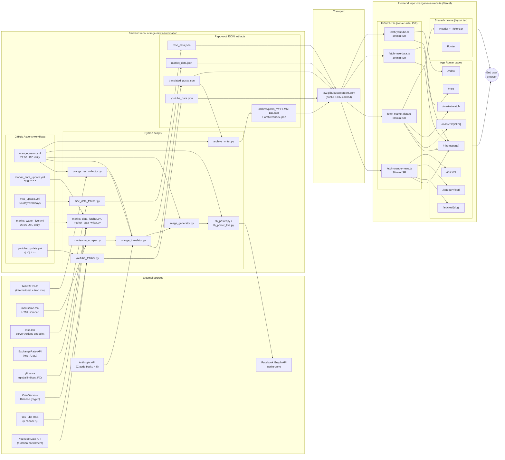

# Orange News — Technical Handbook

**Audience:** internal engineering reference. Founder onboarding + future engineers.
**Scope:** production state as of Sprint Day 15 (2026-05-07). Two-repo system: backend ETL (`orange-news-automation`) + frontend Next.js (`orangenews-website`).
**Companions:** sales / commercialization material lives in `docs/sales/`. Backend per-feature reference docs live in the backend repo's `docs/`.

---

## Table of Contents

1. [Executive Technical Summary](#1-executive-technical-summary)
2. [System Architecture](#2-system-architecture)
3. [Backend Pipeline Reference](#3-backend-pipeline-reference)
4. [Component Reference — Python Scripts](#4-component-reference--python-scripts)
5. [Frontend Route Reference](#5-frontend-route-reference)
6. [Editorial Discipline](#6-editorial-discipline)
7. [Operations Playbook](#7-operations-playbook)
8. [Customization Guide](#8-customization-guide)
9. [Security & Secrets Mechanisms](#9-security--secrets-mechanisms)
10. [Disaster Recovery](#10-disaster-recovery)
11. [Future Roadmap & Deferred Phases](#11-future-roadmap--deferred-phases)
12. [Glossary](#12-glossary)

---

## 1. Executive Technical Summary

### 1.1 What Orange News is

Orange News is a Mongolian-language financial news + market data portal. The system aggregates English- and Russian-language financial news from international wires, translates and editorializes them into Mongolian using a Claude-driven pipeline, layers in live equities + FX + commodity + crypto market data, surfaces the Mongolian Stock Exchange (MSE) as a first-class section, and curates a video feed from six global financial broadcasters. The product positions itself as the *anchor* Mongolian-first financial portal — Bloomberg-grade information design adapted to Mongolian Cyrillic typography, the MSE microstructure, and the local mining/FDI narrative that drives the domestic economy.

### 1.2 Production state as of Day 15 (2026-05-07)

| Surface | State |
|---|---|
| Frontend (`https://orangenews-website.vercel.app`) | 7 page-class routes shipped: `/` homepage, `/articles/[slug]`, `/category/[cat]`, `/markets/[ticker]`, `/market-watch`, `/mse`, `/video`. RSS feed at `/rss.xml`. Subscribe API + verify routes live. |
| Backend (`orange-news-automation`) | 5 production GHA workflows green: daily news pipeline (`orange_news.yml`, 22:00 UTC), market data refresh (`market_data_update.yml`, every 30 min), MSE refresh (`mse_update.yml`, 5× weekdays aligned to MSE trading hours), Market Watch live brief (`market_watch_live.yml`, 23:00 UTC daily), YouTube refresh (`youtube_update.yml`, every 2 hours). ~10 Python scripts. ~36 production commits across the Day 5–14 sprint. |
| Translation depth | 14 RSS feeds (international + ikon.mn) + 1 Mongolian HTML scraper (Montsame, two categories). ~10 articles published per day; archive snapshots preserve every prior day. |
| Market coverage | Global indices, FX, commodities, crypto via free APIs ($0/month), MNT/USD via ExchangeRate-API, MSE TOP-20 via direct mse.mn Server Actions integration (28 datasets enumerated, 8 in MVP). |
| Video curation | 6 canonical YouTube channels (Bloomberg Television, WSJ, Reuters, FT, CNBC, World Bank Group), ~33 surviving videos/refresh after `>3 min` duration filter. |
| Sales infrastructure | `docs/sales/` contains 11 deliverables — outreach templates, demo script, FAQ, pricing model, customer success metrics, sprint retrospective. Ready for first commercial customer onboarding. |
| Production reliability | 0 downtime incidents across the sprint. Slack failure notifications wired to all 3 critical workflows (operator-side `SLACK_WEBHOOK_URL` activation pending). |

### 1.3 Cross-repo architecture at a glance

The system is intentionally split across two repos to decouple data production from data presentation. The backend (`orange-news-automation`, Python on GitHub Actions) runs on cron, writes JSON artifacts (`translated_posts.json`, `market_data.json`, `mse_data.json`, `youtube_data.json`, `archive/posts_YYYY-MM-DD.json`) to its own repo root, and commits them with a `[skip ci]` tag. The frontend (`orangenews-website`, Next.js 16 + React 19 on Vercel) reads those JSON files at the GitHub raw-content URL via ISR-cached fetchers (`src/lib/fetch-*.ts`), with mock-data fallbacks per-fetcher so the UI never blocks on a backend hiccup. There is no shared database, no shared deployment pipeline, and no synchronous coupling — the contract between repos is the JSON schema of those files. This keeps the deployment surface small (the frontend is read-only relative to data), makes the backend independently iterable (any pipeline change ships in seconds without a Vercel redeploy), and gives each side independent revert authority.

### 1.4 Technology stack

| Layer | Choice | Why |
|---|---|---|
| Backend runtime | Python 3.11 on GitHub Actions Ubuntu | Free cron, free compute, zero ops surface |
| Backend deps | `anthropic`, `feedparser`, `httpx`, `Pillow`, `readability-lxml`, `beautifulsoup4`, `yfinance`, `requests`, `python-dateutil` | Standard scraping/translation toolkit, no exotic native deps |
| LLM | Gemini 2.0 Flash (`google-genai` SDK, primary) + Claude Haiku 4.5 (`anthropic` SDK, fallback) for translation. `temperature=0.0–0.2` enforced for all factual tasks. Translator startup-probes Gemini and caches the working model name for the run | Validated 2026-05-04 — default `temperature=1.0` produces hallucinations on financial copy. Dual-vendor (Gemini + Claude) reduces single-API outage risk. |
| Frontend framework | Next.js 16.2.4 + React 19.2.4 (App Router) | ISR + edge runtime + per-route metadata + RSC streaming; **note: this is non-standard Next.js — see `AGENTS.md`, always check `node_modules/next/dist/docs/` before adopting new APIs** |
| Frontend hosting | Vercel (free tier, Hobby plan) | Edge CDN, preview deployments, ENV-aware metadataBase pattern for future custom-domain cutover |
| Styling | Tailwind v4 (`@tailwindcss/postcss`), `@theme` directives, no Tailwind config file | Single-palette source of truth in `globals.css` |
| Email | Resend (`resend` SDK) + `@react-email/components` for templated mail | Subscribe double-opt-in flow (Phase 7.2.1) |
| Type system | TypeScript 5 strict; data-layer normalizers convert backend snake_case to frontend camelCase at fetch boundary | Backend/frontend can evolve naming independently |
| Data transport | GitHub raw-content URL (static JSON) | $0/month, CDN-cached at the GitHub edge, public read-only by design |

### 1.5 What this handbook covers — and what it doesn't

**Covers:** every production component an engineer needs to ship a change confidently. Section 2 walks the architecture diagram. Section 3 walks each cron workflow. Section 4 walks each Python script. Section 5 walks each frontend route. Sections 6–10 cover the editorial, ops, customization, security, and recovery dimensions. Section 11 lists every deferred phase the team has explicitly chosen not to ship yet, with the rationale preserved.

**Does not cover:** sales narrative, customer pricing, market sizing, competitive positioning. Those live in `docs/sales/` (commercialization deliverables) and `docs/handbook/MARKET_RESEARCH.md` (Mongolia financial sector + pricing scenarios). The handbook is the engineer's reference; the sales artifacts are the founder's reference.

**Does not cover:** secret values, webhook URLs, API keys, FB token contents. Section 9 documents the *mechanisms* (where each secret is read, what fails without it, how to rotate) but never the values themselves. Treat the live `gh secret list` and the Vercel project env page as the authoritative secret inventory.

### 1.6 Reading order suggestions

- **New engineer joining the project:** read 1 → 2 → 3 → 5 → 7. That's enough to ship a small frontend change or trigger a manual workflow run safely.
- **Operator handling a broken pipeline:** jump to Section 7 (Operations Playbook) and Section 10 (Disaster Recovery).
- **Founder reviewing scope before a customer meeting:** read 1 → 11. Section 11 is the honest list of what hasn't shipped and why.
- **Adding a new content source or market instrument:** read 8 (Customization Guide) — it's written as a recipe for the most common change shapes.

---

## 2. System Architecture

### 2.1 The two-repo philosophy

Orange News is deliberately split across two GitHub repos that never directly call each other:

- **`orange-news-automation`** (Python, GitHub Actions): the *production* layer. Cron workflows fetch external sources, normalize data, run the LLM translator, generate images, post to Facebook, and commit JSON artifacts back to the same repo.
- **`orangenews-website`** (Next.js 16, Vercel): the *presentation* layer. ISR-cached server components fetch the JSON artifacts from the backend repo's raw-content URL, normalize at the boundary, and render Mongolian-Cyrillic typography against Bloomberg-grade information design.

The contract between the two repos is the **schema of the JSON files at the backend repo root**:

| File | Producer | Consumer | Refresh |
|---|---|---|---|
| `translated_posts.json` | `orange_translator.py` | `lib/fetch-orange-news.ts` | Once daily |
| `market_data.json` | `market_data_writer.py` | `lib/fetch-market-data.ts` | Every 30 min |
| `mse_data.json` | `mse_data_fetcher.py` | `lib/fetch-mse-data.ts` | 5×/day, MSE trading hours, weekdays |
| `youtube_data.json` | `youtube_fetcher.py` | `lib/fetch-youtube.ts` | Every 2 hours |
| `archive/posts_YYYY-MM-DD.json` | `archive_writer.py` | `lib/fetch-orange-news.ts` (via archive helpers) | Once daily, idempotent |
| `archive/index.json` | `archive_writer.py` | `lib/fetch-orange-news.ts` | Once daily |
| `top_news.json` | (legacy, retained) | none active | n/a |

There is no shared database, no shared deployment pipeline, no API surface between the two sides. The backend never reads from the frontend; the frontend never writes back. This is intentional.

### 2.2 Architecture diagram



*(Render the diagram in any Mermaid-aware viewer — GitHub markdown, VS Code preview, or `mmdc` CLI for static export.)*

### 2.3 The lifecycle of one article

To make the architecture concrete, follow a single Bloomberg article from publication on the wire to a clickable card on the homepage:

1. **22:00 UTC** — `orange_news.yml` cron fires. Ubuntu runner spins up. Mongolia timezone set, fonts installed (`fonts-noto`, `fonts-noto-cjk`), Python deps installed.
2. **Phase 1 — RSS collection.** `orange_rss_collector.py` walks the 14 RSS feed list (Bloomberg, Reuters, FT, etc. + ikon.mn + Montsame scraper) and produces a candidate-pool JSON of ~50–80 stories ranked by topic + recency.
3. **Phase 1.5 — Market data sidecar.** `market_data_fetcher.py` runs in parallel (`continue-on-error: true`) so the translator has fresh quotes for any market-related article without blocking on a transient yfinance hiccup.
4. **Phase 2 — Translation.** `orange_translator.py` shortlists ~10 stories. For each: send the English/Russian source through Gemini 2.0 Flash (primary) with Claude Haiku 4.5 fallback at `temperature=0.0–0.2`, prompt-engineered for Mongolian Cyrillic editorial standards (60–80 char headline range, clean lede, no marketing flourish). Mongolian-source articles route through `passthrough_mongolian` (no LLM, just byline preservation).
5. **Phase 3 — Image generation.** `image_generator.py` picks an OG-style 1200×630 banner per article from a curated visual library, overlaying headline text with subset-bundled Noto Sans Cyrillic.
6. **Phase 3.5 — Archive snapshot.** `archive_writer.py` snapshots the produced `translated_posts.json` to `archive/posts_2026-05-07.json` (idempotent — re-runs on the same day overwrite safely) and upserts `archive/index.json`.
7. **Phase 4 — Facebook publication.** `fb_poster.py` (or `fb_poster_live.py` for the Market Watch lead post) schedules the staggered 09:00–17:00 MNT publication queue.
8. **Phase 5 — Commit.** GHA's `git commit -am "..." [skip ci]` stages `translated_posts.json` + `archive/` and pushes to `main`. The `[skip ci]` tag prevents the commit from re-triggering CI.
9. **Vercel — passive.** No webhook, no deploy. The frontend is unchanged.
10. **First reader hits the homepage.** Next.js executes `fetchOrangeNews()` server-side, fetches `translated_posts.json` from `raw.githubusercontent.com/.../main/translated_posts.json`, normalizes snake_case → camelCase via `mapPost()`, scores + sorts, renders Hero + SecondaryArticles + ArticleFeed. The result is cached at the ISR layer for 30 minutes.
11. **Second reader hits the homepage.** Cache HIT. Page served in <100ms from Vercel edge.
12. **31st minute.** Cache stale. Next reader triggers a background revalidation; they see the previous render, the next reader sees fresh data. ISR semantics — never blocks a request on a fetch.

### 2.4 Read/write boundaries

The strict invariant is: **the frontend writes nothing back to the backend**.

| Side | Writes to | Reads from |
|---|---|---|
| Backend repo | Its own repo root JSON files; `archive/`; `pipeline_log.txt`; `logs/` | External APIs (RSS, mse.mn, yfinance, CoinGecko, ExchangeRate-API, YouTube, Anthropic) |
| Frontend (Vercel runtime) | Resend (Subscribe API outbound only); response headers (Cache-Control, Content-Type) | `raw.githubusercontent.com` (read-only, public) |
| Frontend (Vercel build) | Next.js build artifacts | Source code in `orangenews-website` repo |

The Subscribe API is the only outbound write the frontend does, and it goes to Resend (third-party SaaS), not back to the backend. Even Slack failure notifications are emitted from the backend's GitHub Actions workflow, not from the frontend.

### 2.5 ISR cache topology

Every fetcher in `lib/fetch-*.ts` uses Next.js's `revalidate: 1800` (30 minutes) ISR window. The cache layers stack:

```
End user
  ↓
Vercel edge CDN (HTML cache, varies by route)
  ↓
Next.js ISR data cache (per-fetch, 30 min)
  ↓
GitHub raw-content CDN (~5 min edge cache)
  ↓
GitHub git storage (canonical)
```

A backend commit propagates through this stack in approximately:
- Backend `git push` → GitHub git storage: < 5 sec
- GitHub git → raw-content CDN: 0–5 min (CDN warm-up, depends on edge)
- raw-content CDN → Next.js ISR: 0–30 min (until next revalidation)
- Next.js ISR → end user: 0–N (until next request triggers stale-while-revalidate)

**Total worst case end-to-end propagation: ~35 min.** This is acceptable for non-trading-floor consumers and is the explicit Phase 5.3 design tradeoff (free-tier cost preservation over real-time freshness). For sub-second freshness the architecture would need a webhook trigger (Vercel On-Demand Revalidation API) — deferred.

### 2.6 Failure modes & graceful degradation

Every fetcher in the frontend has a **mock-data fallback**. If the GitHub raw URL returns 404 (file removed), 500 (GitHub outage), or any network error, the fetcher returns the in-repo mock data and tags the response envelope `source: "mock"`. The UI continues to render. This is the central reliability invariant: *the homepage never breaks because the backend is broken*.

| Failure | Effect | Recovery |
|---|---|---|
| Backend GHA workflow fails | Stale data served from existing JSON until the fix lands. Slack notification fires (when `SLACK_WEBHOOK_URL` is set). | Operator triggers manual `gh workflow run`, or fixes the underlying issue and waits for next cron tick. |
| Backend JSON file deleted from repo | Frontend fetcher returns mock data (`source: "mock"` flag visible in the response envelope; not user-visible). | Re-commit the file, or wait for next backend run to regenerate. |
| GitHub raw-content CDN slow | First request after revalidation is slow; subsequent requests cached. | None — transient. |
| Vercel deployment broken | Site down. | `vercel rollback` or fix-forward. |
| External API rate-limited (yfinance, CoinGecko) | `market_data_fetcher.py` logs the failure, downstream JSON keeps the previous tick. | Backend cron retries on next interval. `continue-on-error: true` ensures the daily news pipeline doesn't fail because of a market-quote glitch. |
| `temperature` left at default 1.0 | LLM hallucinates on financial copy. | Hard-coded `0.0–0.2` enforced in `orange_translator.py`. Validated 2026-05-04. |

### 2.7 Why this architecture (decision log highlights)

Five non-obvious choices an engineer should understand before proposing changes:

1. **Two-repo split, not monorepo.** The presentation layer iterates 10× faster than the data layer (UI tweaks, copy fixes) and has a different deployment target (Vercel vs GitHub Actions). A monorepo would couple their CI runs and force the frontend to wait on backend test cycles. The split is *worth* the duplicated tooling.
2. **JSON files via raw-content URL, not a database.** A free-tier Postgres or KV store would add deploy complexity and bill at usage scale; a public JSON contract is $0/month forever, has CDN caching for free, and any engineer can `curl` it to debug. The cost is the 30-min freshness ceiling — accepted.
3. **Mock fallbacks per fetcher.** Phase 4 Step 2 introduced mock data as the *rendering source of truth* until backend caught up. The pattern proved durable: it now serves as the resilience layer too. Removing mocks would couple frontend uptime to backend uptime — deliberate non-coupling preserved.
4. **MSE via Server Actions endpoint, not TradingView.** Plan B (originally drafted) used a TradingView embed because no MSE API was known to exist. Plan C (shipped) discovered mse.mn's Next.js Server Actions endpoint via JS chunk analysis — direct integration, 8 datasets in MVP, no third-party dep. See `docs/mse_phase6.2_endpoint.md` in the backend repo for the action-ID rotation logic.
5. **ExchangeRate-API for MNT/USD, not yfinance.** `yfinance USDMNT=X` ticker has been broken since at least Apr 2026; the request returns empty quotes. ExchangeRate-API gives a single-call, free, reliable MNT/USD figure. Mongolbank XML parse was considered and rejected (parse complexity, intermittent endpoint).

These five decisions together produce a system that costs **$0/month at production scale**, has **0 single-vendor lock-in beyond GitHub + Vercel + Anthropic**, and survives any single external API failure without user-visible breakage.

---

## 3. Backend Pipeline Reference

This section enumerates each of the 5 production GitHub Actions workflows. For every workflow: cadence, trigger, step graph, outputs, secrets consumed, failure handling, and operator commands.

### 3.0 Workflow inventory at a glance

| Workflow | File | Cron (UTC) | Translation MNT | Frequency | Outputs | Approx run time |
|---|---|---|---|---|---|---|
| Orange News Daily Pipeline | `orange_news.yml` | `0 22 * * *` | 06:00 next day | 1×/day | `translated_posts.json`, `archive/posts_YYYY-MM-DD.json`, FB posts | 5–47 min |
| Market Watch Live | `market_watch_live.yml` | `0 23 * * *` | 07:00 next day | 1×/day | Market Watch FB post (live, not scheduled), `translated_posts.json`, archive | 4–5 min |
| Market Data Live Update | `market_data_update.yml` | `*/30 * * * *` | every 30 min | 48×/day | `market_data.json` | ~30 sec |
| MSE Data Refresh | `mse_update.yml` | `0 2,3,4,8,9 * * 1-5` | 10:00, 11:00, 12:00, 16:00, 17:00 | 5×/weekday | `mse_data.json` | ~30 sec |
| YouTube Data Refresh | `youtube_update.yml` | `0 */2 * * *` | every 2 hours | 12×/day | `youtube_data.json` | ~15–30 sec |

All five workflows share the same five idioms: `actions/checkout@v4` → `actions/setup-python@v5` (3.11) → `pip install` → run script → `git add + commit -m "[skip ci]" + push if diff` → optional `Notify Slack on failure`. The interesting variation is in **what each script does**, not in the workflow scaffolding.

### 3.1 `orange_news.yml` — Daily News Pipeline

**Purpose:** the heaviest workflow. Walks 14 RSS feeds + Montsame scraper, runs the translator across the top ~10 stories, generates branded images, schedules the Facebook publish queue, snapshots the archive, and commits the day's `translated_posts.json` back to the repo.

**Cron:** `0 22 * * *` UTC = 06:00 MNT (next calendar day, since Mongolia is UTC+8). The 22:00 UTC slot is intentionally chosen as off-peak — GHA scheduler queue delays in the 07:00–09:00 UTC window are well-documented; the 22:00 slot typically sees < 1 min queue lag.

**Trigger types:** scheduled cron, plus `workflow_dispatch` with input `live: 'true' | 'false'` (manual dry-run support — `false` skips the actual FB write).

**Step graph:**

```
1. Checkout code
2. Set Mongolia timezone (Asia/Ulaanbaatar) for log timestamps
3. Setup Python 3.11
4. Install Mongolian fonts (fonts-noto, fonts-noto-cjk) — required for image_generator.py
5. pip install: anthropic, google-genai, python-dotenv, feedparser,
                httpx, certifi, python-dateutil, yfinance, Pillow,
                requests, readability-lxml, beautifulsoup4
6. Phase 1   — orange_rss_collector.py    [hard fail]
7. Phase 1.5 — market_data_fetcher.py     [continue-on-error: true]
8. Phase 2   — orange_translator.py       [Gemini primary, Claude fallback]
                                          [hard fail — without translation, no posts]
9. Phase 2.5 — image_generator.py         [hard fail — FB needs images]
10. Phase 3  — fb_poster.py [--live]      [hard fail]
11. Phase 3.5 — archive_writer.py          [if: always(), idempotent]
12. Phase 4  — git commit translated_posts.json + archive/ [skip ci]
                                          [if: always()]
13. Upload artifacts (top_news.json, translated_posts.json, generated PNGs,
                      pipeline_log.txt) — 7-day retention
14. Notify Slack on failure (if: failure())
```

**Secrets consumed:** `GEMINI_API_KEY`, `ANTHROPIC_API_KEY`, `FB_PAGE_ID`, `FB_ACCESS_TOKEN`, `SLACK_WEBHOOK_URL` (operator-pending).

**Notable behavior:**
- Phase 1.5 is `continue-on-error: true` — a yfinance hiccup must not block the day's news cycle. The translator has an internal fallback to the previous tick's market data.
- Phase 3.5 (archive) and Phase 4 (commit) both run with `if: always()` — partial failure still yields a partial archive snapshot, preserving forensic value.
- The `[skip ci]` tag in the commit message prevents the auto-commit from re-triggering CI (which would otherwise loop).
- Timeout 60 min; typical run is 5–10 min, occasional 47-min outliers correlate with translator re-tries on rate-limit.

**Operator commands:**
```bash
# Manual run (dry-run, no FB write)
gh workflow run orange_news.yml -f live=false

# Manual run (live FB publish)
gh workflow run orange_news.yml -f live=true

# View latest 3 runs
gh run list --workflow=orange_news.yml --limit=3

# Tail a specific run
gh run watch <run-id>
```

### 3.2 `market_watch_live.yml` — Daily Market Watch Brief

**Purpose:** publishes the day's "Market Watch" Facebook post immediately (not scheduled). This is the lead post — it goes live at ~07:15 MNT, before the news pipeline's staggered 09:00–17:00 cycle starts.

**Cron:** `0 23 * * *` UTC = 07:00 MNT (next calendar day). 60-min buffer before the news pipeline's first scheduled post at 09:00 MNT.

**Step graph:** structurally similar to `orange_news.yml` Phases 1, 1.5, 2, 4 — but Phase 3 is replaced with `fb_poster_live.py --live` instead of `fb_poster.py`. Key difference: `fb_poster_live.py` calls the Facebook Graph API with `scheduled_publish_time=None`, which publishes immediately. `fb_poster.py` (used by `orange_news.yml`) sets `scheduled_publish_time` to a 09:00–17:00 MNT timestamp, queuing the posts in Facebook's native scheduler.

**Concurrency setting:** `cancel-in-progress: false` — manual + cron overlap protection. If the operator triggers a `workflow_dispatch` while the cron is still running, the manual run waits rather than killing the cron.

**Secrets consumed:** identical to `orange_news.yml`.

**Notable behavior:**
- The translator runs over all ~10 candidates produced by Phase 1; `fb_poster_live.py` then selects only the Market Watch story to publish, leaving the others queued for the news pipeline's later run that day. (Phase 4 commit captures all translated posts; downstream consumers see them.)

### 3.3 `market_data_update.yml` — Market Data Live Update

**Purpose:** the highest-cadence workflow. Refreshes `market_data.json` every 30 min so the ticker bar, homepage MarketSnapshot, and `/markets/[ticker]` detail pages stay close to live.

**Cron:** `*/30 * * * *` UTC = every 30 min, 24/7.

**Step graph:** dramatically simpler than the news pipelines — checkout → Python 3.11 → install (`yfinance`, `requests`, `beautifulsoup4`) → `python3 market_data_writer.py` → commit-if-diff.

**Concurrency:** `cancel-in-progress: true` — if a slow run is still going when the next 30-min slot fires, the older run is killed. Prevents queue buildup.

**Free-tier budget:** ~720 runs/month × ~30 sec each = ~360 min/month. Well below the 2,000-min GitHub-Actions free-tier cap.

**Notable absence:** no Slack failure notification step in this workflow (Phase 8.1 Track A excluded the high-cadence runners on purpose — a bad ticker quote does not warrant a push notification, and noisy alerts erode trust in real failure signals).

**Secrets consumed:** none — all data sources are unauthenticated public APIs (yfinance, ExchangeRate-API, CoinGecko, Binance public endpoints).

### 3.4 `mse_update.yml` — MSE Data Refresh

**Purpose:** refreshes `mse_data.json` from the mse.mn Server Actions endpoint discovered during Phase 6.2. Drives the `/mse` route + the homepage MSE TOP-20 cell.

**Cron:** `0 2,3,4,8,9 * * 1-5` UTC = 5 fires per weekday at MNT 10:00 / 11:00 / 12:00 / 16:00 / 17:00. Weekends excluded — MSE doesn't trade. The clustered slot pattern (3 morning + 2 afternoon) is intentional retry insurance against GHA scheduler misses; in production we have observed 3h38m drift on a single morning slot, which the redundant slots cover.

**Step graph:** checkout → Python 3.11 → install `requests` → `python3 mse_data_fetcher.py` → commit-if-diff → Slack notify on failure.

**Concurrency:** `cancel-in-progress: true`.

**Notable behavior:**
- `mse_data_fetcher.py` is the script most prone to silent breakage because the mse.mn endpoint relies on a Next.js Server Action ID that rotates ~1–3 months per upstream redeploy. The fetcher detects this via `Content-Type != "x-component"` (mse.mn returns 200 + homepage HTML when the action is stale, not a 4xx) and auto-rediscovers via `/_next/static/chunks/*.js` regex scan + brute-force probe fallback. See `docs/mse_phase6.2_endpoint.md` in the backend repo for full mechanics + 28-dataset enumeration.

**Free-tier budget:** ~25 runs/week × ~30 sec ≈ 12 min/month — negligible.

### 3.5 `youtube_update.yml` — YouTube Video Feed Refresh

**Purpose:** refreshes `youtube_data.json` from the 6 curated YouTube channel RSS feeds + a single batched `videos.list?part=contentDetails` API call for duration enrichment (used to filter out Shorts that fail the `>3 min` quality threshold).

**Cron:** `0 */2 * * *` UTC = every 2 hours, 24/7.

**Step graph:** checkout → Python 3.11 → install `requests`, `feedparser` → `python3 youtube_fetcher.py` → commit-if-diff → Slack notify on failure.

**Secrets consumed:** `YOUTUBE_API_KEY` (required for duration enrichment; without it the `>3 min` filter cannot be applied and shorts pollute the feed).

**Quota math:** ~24 units/day actual (per-call cost model — `videos.list` charges per call, not per ID); ≈ 0.24% of the 10K free quota. Massive headroom.

**Concurrency:** `cancel-in-progress: true`.

**Notable behavior:**
- 6 canonical channel UC IDs hardcoded in `youtube_fetcher.py`: Bloomberg Television, WSJ, Reuters, Financial Times, CNBC, World Bank Group. Adding a channel = one-line edit.
- `deny_list_videos.json` (committed to repo, empty array seed) lets the operator veto specific video IDs without code changes — useful for removing off-topic content the algorithmic filter missed.
- Channel distribution skew: Bloomberg + CNBC together produce ~75% of surviving videos because WSJ / FT / Reuters publish mostly Shorts. Three known mitigation options: per-channel cap, lower duration threshold, accept current distribution. Decision deferred (Phase 7.3.x).

### 3.6 Cross-cutting concerns

**The commit-if-diff idiom:** all 5 workflows use the identical pattern at the end:

```yaml
- name: Commit X if changed
  run: |
    git config user.name "github-actions[bot]"
    git config user.email "41898282+github-actions[bot]@users.noreply.github.com"
    git add <file>
    if git diff --staged --quiet; then
      echo "No data changes — skipping commit"
    else
      git commit -m "data: update <file> [skip ci]"
      git push
      echo "Pushed <file>"
    fi
```

Three properties this idiom guarantees:
1. **No empty commits** — `git diff --staged --quiet` short-circuits when the new write equals the previous tick.
2. **No CI loop** — `[skip ci]` in the commit message prevents the auto-commit from re-triggering workflows.
3. **Audit trail** — every data change is a discrete commit attributable to `github-actions[bot]`, signed by GitHub's bot identity, viewable via `git log`.

**Git allowlist patterns:** `.gitignore` contains category-level blanks like `*.json`, but all production data files are explicitly allowlisted via `!`-rules:

```gitignore
*.json
!translated_posts.json
!market_data.json
!mse_data.json
!youtube_data.json
!deny_list_videos.json
!archive/index.json
archive/
!archive/
!archive/*.json
```

Without these allowlist rules, the bot's writes would be silently dropped. This is the same lesson Phase 7.1 surfaced when archive writes initially appeared to "succeed" but disappeared from `git status`.

**Slack failure notifications:** wired identically in 4 of 5 workflows (orange_news, market_watch_live, mse_update, youtube_update). Excluded from `market_data_update.yml` deliberately — a 30-min cadence with transient yfinance errors would generate notification noise. The webhook URL is read from repo secret `SLACK_WEBHOOK_URL`; without it the step is a no-op (action gracefully no-ops on missing webhook). Operator activation: `gh secret set SLACK_WEBHOOK_URL --body "<url>" -R mctunghai-pixel/orange-news-automation`.

**Concurrency groups:** every workflow that writes to git uses a `concurrency:` block to prevent race conditions. The choice of `cancel-in-progress: true` (data-refresh workflows) vs `false` (market_watch_live, where killing a partially-completed FB publish would leave inconsistent state) is deliberate.

**Manual operator commands cheat-sheet:**

```bash
# List all workflows
gh workflow list -R mctunghai-pixel/orange-news-automation

# Trigger any workflow manually
gh workflow run <workflow-file.yml> [-f input=value]

# View recent runs (any workflow)
gh run list --workflow=<workflow-file.yml> --limit=10

# Fetch logs for a specific run
gh run view <run-id> --log

# Re-run only failed jobs from a specific run
gh run rerun <run-id> --failed
```

---

## 4. Component Reference — Python Scripts

The backend repo contains 11 Python files plus one shell entry point, totaling ~5,028 lines of code. This section gives each component a one-page reference: purpose, inputs, outputs, dependencies, and the gotchas an engineer should know before editing.

### 4.0 Inventory at a glance

| Script | Lines | Layer | Run by |
|---|---|---|---|
| `orange_rss_collector.py` | 451 | Collection | `orange_news.yml`, `market_watch_live.yml` Phase 1 |
| `montsame_scraper.py` | 221 | Collection (HTML) | invoked from `orange_rss_collector.py` |
| `orange_translator.py` | 1,760 | Translation | `orange_news.yml`, `market_watch_live.yml` Phase 2 |
| `image_generator.py` | 437 | Publishing | `orange_news.yml` Phase 2.5 |
| `fb_poster.py` | 414 | Publishing (scheduled) | `orange_news.yml` Phase 3 |
| `fb_poster_live.py` | 121 | Publishing (immediate) | `market_watch_live.yml` Phase 3 |
| `archive_writer.py` | 141 | Persistence | `orange_news.yml`, `market_watch_live.yml` Phase 3.5 |
| `market_data_fetcher.py` | 475 | Market data (embedded helper) | `orange_news.yml`, `market_watch_live.yml` Phase 1.5 |
| `market_data_writer.py` | 299 | Market data (standalone) | `market_data_update.yml` |
| `mse_data_fetcher.py` | 405 | MSE | `mse_update.yml` |
| `youtube_fetcher.py` | 304 | Video | `youtube_update.yml` |
| `run_pipeline.sh` | shell | Orchestration (local dev) | operator-run only |

### 4.1 Collection layer

#### `orange_rss_collector.py`
Walks 14 RSS feed sources (4 tech, 6 finance, 2 crypto, 1 AI, 1 Mongolia) plus the Montsame HTML scraper, applies keyword scoring + recency weighting, deduplicates, and selects the top 10 stories (1 Market Watch + 9 news). The `RSS_FEEDS` constant is the single source of truth — adding a feed is a one-line append. Each feed has a category + weight; the weight nudges the topic-classification scoring without overriding it.

- **Inputs:** none (reads RSS over HTTPS).
- **Outputs:** `top_news.json` at repo root.
- **Mongolia route:** Mongolia-category feeds (currently ikon.mn) bypass the translator entirely via the `passthrough_mongolian` branch in `orange_translator.py` — the article is preserved verbatim with byline intact.
- **SSL handling:** sets `SSL_CERT_FILE` + `REQUESTS_CA_BUNDLE` to `certifi.where()` so corporate cert stores don't break feedparser. Some feeds (Reuters Agency, FT) are sensitive to UA strings — known fragility.

#### `montsame_scraper.py`
BeautifulSoup-based scraper for `montsame.mn` (state news agency, Mongolian-language). Phase 6.1.5 addition. The Mongolian web does not expose RSS broadly; Montsame was the highest-value target reachable by scrape.

- **Inputs:** none.
- **Outputs:** returns a list of article dicts to the caller (`orange_rss_collector.py`).
- **Coverage:** two categories — Эдийн засаг (`/mn/more/10`) and Уул уурхай (`/mn/more/16`). Body extraction uses a "longest `.content-mn` block" heuristic with `og:description` fallback.
- **Resilience:** 3-attempt HTTP retry with exponential backoff. Soft-fail at every layer — a Montsame outage does not break the news pipeline.
- **Maintenance hazard:** if Montsame changes their CSS class names, the `.content-mn` selector breaks silently and articles will start coming back as the `og:description` fallback (shorter, less editorial). See `docs/montsame_phase6.1.5.md` in the backend repo.

### 4.2 Translation layer

#### `orange_translator.py` (v8)
The largest single file in the repo (1,760 lines). Translates the top-10 candidate articles into editorial Mongolian Cyrillic, generates the daily Market Watch synthesis post, and writes the final `translated_posts.json`.

- **Primary path:** Gemini 2.0 Flash via `google-genai` SDK. Free tier, validated for Mongolian output quality.
- **Fallback path:** Claude Haiku 4.5 via `anthropic` SDK. Triggered when Gemini fails (rate limit, quota, API outage).
- **Startup probe:** caches the working Gemini model name for the run, so a single probe cost amortizes across all 10 articles.
- **Per-article logging:** every translation is recorded to `logs/translation_YYYYMMDD_HHMM.json` for forensic review (input source, model used, retries, validation results, output length).
- **Validation layer:** every translated article is checked for: headline length within 60–80 char band, no concatenation errors (Cyrillic + Latin glued together), correct source-attribution tag, no banned phrases (drift markers like "translated by AI"). Failures retry with stricter prompt; persistent failures fall through to the fallback model.
- **Temperature:** `0.0–0.2` enforced on both Gemini and Claude calls. The default `1.0` was validated on 2026-05-04 to produce hallucinations on financial copy and is no longer used.
- **Mongolia passthrough:** articles tagged `category: "mongolia"` (from ikon.mn or Montsame) bypass translation entirely — body preserved, byline intact.
- **Market Watch generator:** a separate code path produces the daily synthesis post (top movers + macro context + Mongolian framing) using the freshly-fetched market data. This is the lead post for the next day's publish queue.
- **Footer builder:** every published article gets a standardized footer with source attribution, OrangeNews branding, and call-to-action — generated by a dedicated helper, not embedded in the LLM prompt (deterministic, not stochastic).

### 4.3 Publishing layer

#### `image_generator.py`
Generates the OG-style 1200×630 banner image for each translated post. Pillow-based. Uses Noto Sans Cyrillic (subset bundled in the workflow's `apt install fonts-noto`). The output PNGs are written to `assets/generated/` and uploaded as run artifacts (7-day retention).

- **Inputs:** `translated_posts.json` (read-only).
- **Outputs:** `assets/generated/post_NN_YYYYMMDD.png` per article + `market_watch_thumbnail.png` for the Market Watch post.
- **Failure mode:** missing fonts → broken Cyrillic glyphs (squares). Mitigated by the workflow's explicit `apt-get install -y fonts-noto fonts-noto-cjk` step.
- **Backup file present:** `image_generator.py.backup-padding-20260503_142321` — pre-padding-tweak backup, retained for forensic comparison; not invoked by any workflow.

#### `fb_poster.py` (414 lines)
Schedules the day's news posts to Facebook Page via the Graph API. Each post gets a `scheduled_publish_time` between 09:00 and 17:00 MNT (60-min stagger) and goes through the FB scheduler natively. Idempotency is achieved by the `[skip ci]`-tagged commit pattern — re-running the workflow on the same day re-translates and re-schedules, but the FB scheduler dedupes against article IDs.

- **Inputs:** `translated_posts.json` + `assets/generated/*.png`.
- **Outputs:** Facebook Page scheduled posts (no local file output; logs to `pipeline_log.txt`).
- **CLI flag:** `--live` actually writes to Facebook; without it, the script logs the planned publish queue and exits (dry-run).
- **Secrets consumed:** `FB_PAGE_ID`, `FB_ACCESS_TOKEN`. Token rotation is the highest-priority operator concern — the original short-lived token has a ~30-day buffer; migration to a long-lived System User token is a queued Day 13 spec item.

#### `fb_poster_live.py` (121 lines)
The "publish immediately" sibling of `fb_poster.py`. Used only by `market_watch_live.yml` for the daily Market Watch lead post (07:00–07:15 MNT). The key difference: `scheduled_publish_time=None` in the Graph API call, which makes the post live immediately. Selects only the Market Watch story from the day's translated set, leaving the other 9 news articles for the news pipeline's later run that day.

- Smaller surface area than `fb_poster.py` (no scheduling logic, no stagger). 121 vs 414 lines.

### 4.4 Persistence layer

#### `archive_writer.py` (Phase 7.1)
Snapshots `translated_posts.json` into `archive/posts_YYYY-MM-DD.json` and upserts the corresponding entry in `archive/index.json`. Date is determined in MNT (`Asia/Ulaanbaatar`) so archive boundaries match the editorial day, not UTC.

- **Schema (per-day file):** `{date, generated_at, source, posts[]}` — wrapped, not raw.
- **Schema (index):** `[{date, count}, ...]` — sorted desc by date.
- **Idempotency:** re-running for the same date overwrites the per-day file and upserts the index entry. Safe to invoke from both daily workflows (`orange_news.yml` + `market_watch_live.yml`); whichever runs second wins.
- **Mtime safety guard:** when `--date` is not explicitly provided, the script verifies `translated_posts.json` was last modified within the same MNT day. If the translator failed earlier in the pipeline and left yesterday's file in place, the archive write is **skipped** rather than archiving stale content.
- **CLI:** `--date YYYY-MM-DD` to override; `--source <workflow filename>` to tag the snapshot.

### 4.5 Market data layer

The repo has *two* scripts that look superficially similar but serve different roles:

#### `market_data_writer.py` (299 lines, used by `market_data_update.yml`)
The **canonical** market data refresher. Standalone — runs on its own 30-min cron, fetches 7 yfinance tickers (spx, dji, ixic, btc, eth, xau, cl) + mntusd via ExchangeRate-API, and writes `market_data.json` at the repo root. Schema matches the frontend `MarketInstrument` type exactly — no transformation layer needed.

- **Partial-failure semantics:** if some tickers succeed and others fail, the script merges fresh data into the existing `market_data.json` so missing instruments keep their last-known values. On total failure, the existing file is left untouched and the script exits non-zero — CI then skips the commit.
- **MNT/USD via ExchangeRate-API:** `yfinance USDMNT=X` and `MNT=X` always return 1 row regardless of period — the ticker is effectively unusable (this is documented inline in the code as a hazard note).

#### `market_data_fetcher.py` (475 lines, used by news pipelines)
The **in-pipeline helper** for the daily news workflows. Has a richer 3-tier FX fallback chain (Mongolbank JSON API → ExchangeRate-API → Frankfurter + yfinance USDMNT) for resilience. Output is consumed by the translator for fresh market context in news copy, then made available downstream — the `[skip ci]` commit at Phase 4 captures any updates as part of the daily news commit.

The two scripts share the goal (fresh quotes) but diverge on *risk tolerance*: the writer prefers a simple, quick path and tolerates partial failures; the fetcher is more defensive because the translator depends on it for narrative quality.

### 4.6 MSE layer

#### `mse_data_fetcher.py`
Direct integration with mse.mn's Next.js Server Actions endpoint. Phase 6.2 work — the discovery that mse.mn exposes a callable RPC-style endpoint via custom HTTP headers (`Next-Action: <action-id>`) was the architectural unlock for this section. Fetches 8 datasets (`marquee`, `stock_amount`, `stock_up`, `stock_down`, `comex_trade`, `mseA_list`, `mseB_list`, `top20_list`) in MVP; 28 are enumerated total (20 reserved for Phase 6.3+).

- **Action-ID rotation tolerance:** the most fragile part of the system. The action-ID hash rotates every 1–3 months when mse.mn redeploys their Next.js app. The fetcher detects staleness via `Content-Type != "x-component"` (mse.mn returns 200 + homepage HTML when the action is stale, NOT a 4xx — this is what makes it tricky). On staleness, auto-rediscovery scans `/_next/static/chunks/*.js` for action-ID pattern via regex, with brute-force probe fallback.
- **Errors envelope:** writes `errors[]` into `mse_data.json` for operator visibility. The frontend reads this envelope and degrades gracefully.
- See `docs/mse_phase6.2_endpoint.md` in the backend repo for full mechanics.

### 4.7 Video layer

#### `youtube_fetcher.py`
RSS-based discovery for the 6 canonical YouTube channels, plus a single batched `videos.list?part=contentDetails` API call (up to 50 IDs per call) for duration enrichment.

- **Why API enrichment:** YouTube RSS does not expose duration. Without `videos.list`, the `>3 min` quality filter (designed to exclude Shorts) cannot be applied.
- **Quota cost:** `videos.list` is per-call, not per-ID — making it ~24 units/day total, ≈ 0.24% of the 10K free quota.
- **Soft-fail per channel:** a single channel RSS hiccup doesn't break the run; the failure is logged in `errors[]` (matches the `mse_data_fetcher.py` pattern).
- **Mongolia relevance flag:** OR-semantics, never an exclusion. A video can be flagged `mongoliaRelevant: true` for UI accent (МОНГОЛ badge) but the flag never removes content.
- **Deny list:** `deny_list_videos.json` (committed, empty array seed) lets the operator veto specific video IDs without code changes.
- See `docs/youtube_phase7.3.md` in the backend repo.

### 4.8 Shell orchestration

#### `run_pipeline.sh`
Local-developer entry point that mirrors `orange_news.yml`'s phase order. Used for testing the pipeline outside CI (e.g., before pushing a change to `orange_translator.py`). Two modes: `./run_pipeline.sh` (TEST, skips FB write) and `./run_pipeline.sh --live` (LIVE, writes to FB — requires `FB_PAGE_ID`, `FB_ACCESS_TOKEN`, `ANTHROPIC_API_KEY` exported in shell).

- **Not invoked by any workflow** — purely local/operator tooling.
- **Logs to `pipeline_log.txt`** with timestamp prefixes, same format as the GHA-side logs.

### 4.9 Editing safety notes

A few cross-cutting rules the engineer should internalize before touching any of these scripts:

1. **`temperature` is non-negotiable.** Every LLM call must set `temperature` between 0.0 and 0.2. The default 1.0 produces hallucinations on financial copy. This rule is enforced by code review, not by the API.
2. **Soft-fail by default in collectors.** A single RSS feed timing out should never break the day. Every script in §4.1 follows the pattern: try → except → log → continue with empty list for that source.
3. **Schema changes break the frontend.** The JSON contract (§2.1 table) is read by the frontend with a normalizer at the boundary. Renaming a field in `market_data_writer.py` without updating `lib/fetch-market-data.ts` will silently degrade the homepage. Do schema changes in coordinated cross-repo commits with explicit testing on both sides.
4. **Backup files are forensic, not active.** `image_generator.py.backup-*` and `orange_translator.py.backup-*` are pre-change snapshots retained for diff comparison. They are not imported, not invoked, and should not be modified.
5. **Logs are operator-readable, not just machine-parseable.** Cyrillic emoji prefixes in log lines (📡 RSS, 🤖 Translator, 📘 FB poster, 🗄️ Archive) are deliberate — they make `pipeline_log.txt` scannable when an operator is debugging at speed.

---

## 5. Frontend Route Reference

The frontend uses Next.js 16 App Router. Every route is a directory under `src/app/`. This section walks the seven primary page-class routes + the RSS feed + the Subscribe API flow, plus a closing table for supporting routes.

### 5.0 Route inventory

| Path | File | Type | Data sources | ISR |
|---|---|---|---|---|
| `/` | `app/page.tsx` | Page | `fetchOrangeNews`, `fetchMarketData`, `fetchMseData`, `fetchYouTubeData` | 30 min |
| `/articles/[slug]` | `app/articles/[slug]/page.tsx` | Dynamic page | `fetchOrangeNews({archiveDays:7})` + `getPostBySlug` | 30 min |
| `/category/[cat]` | `app/category/[cat]/page.tsx` | Dynamic page | `fetchOrangeNews` + `CATEGORY_SLUG_MAP` | 30 min |
| `/markets/[ticker]` | `app/markets/[ticker]/page.tsx` | Dynamic page | `fetchMarketData` + `TICKER_SLUG_MAP` | 30 min |
| `/market-watch` | `app/market-watch/page.tsx` | Page | `getMarketWatch` (filtered `fetchOrangeNews`) | 30 min |
| `/mse` | `app/mse/page.tsx` | Page | `fetchMseData` (8 datasets) | 30 min |
| `/video` | `app/video/page.tsx` | Page | `fetchYouTubeData` + `?channel=` filter | 30 min |
| `/rss.xml` | `app/rss.xml/route.ts` | Route Handler | `fetchOrangeNews({archiveDays:7})` | 1 hr |
| `/api/subscribe` | `app/api/subscribe/route.ts` | API (POST) | Resend Audiences | n/a |
| `/api/subscribe/verify` | `app/api/subscribe/verify/route.ts` | API (GET) | HMAC token validate + Resend flip | n/a |
| `/newsletter/confirmed` | `app/newsletter/confirmed/page.tsx` | Status landing | `?status=` query | static |
| OG images | `app/opengraph-image.tsx` + per-route variants | Edge image route | route metadata | edge |

The shared chrome — `Header`, `TickerBar` (loaded via `TickerBarLoader`), `Footer` — is mounted once in `app/layout.tsx` and inherited by every route automatically. No per-page chrome imports.

### 5.1 `/` — Homepage

The most data-dense route. Fetches **all four** backend JSON files in a single `Promise.all` so the request fans out concurrently:

```ts
const [{posts}, marketResult, mseResult, youtubeResult] =
  await Promise.all([fetchOrangeNews(), fetchMarketData(),
                     fetchMseData(), fetchYouTubeData()]);
```

The page composes:
- **Hero** — top-scored news article + lead headline + sparkline.
- **SecondaryArticles** — next 4 ranked articles, bento-style grid.
- **BreakingStrip** — `isMarketWatch`-flagged article gets a distinct styled strip above the fold.
- **MarketSnapshot** (formerly `MarketWatch.tsx`, renamed to resolve naming collision with the `/market-watch` route) — 4-quadrant grid with 12 cells; 8 wired to live `instruments` map, 4 honest-stub cells (SOL, MSE TOP-20, Оюу Толгой, Зэс) marked with em-dash + tooltip.
  - MSE TOP-20 cell uses **Plan A migration**: synthesized from the live `mseData.marquee` instead of being filtered through `TICKER_SLUG_MAP` (which silently dropped it). See §2.7 decision log.
- **ArticleFeed** — score-desc list of remaining articles, news-only filter.
- **VideoFeed** (right rail) — 6 video cards from `youtube_data.json`, links to `/video` archive.
- **NewsletterSection** — Subscribe form (Phase 7.2.1, `dark` variant).

### 5.2 `/articles/[slug]` — Article Detail

Server component. `getPostBySlug(slug)` first checks today's `translated_posts.json`; on miss, walks the archive desc via `fetchArchiveDay(date)` for each entry in `archive/index.json`. This keeps yesterday's articles addressable after the daily pipeline overwrites `translated_posts.json`.

- **ArticleNavigation** (prev/next) derives from `fetchOrangeNews({archiveDays:7})` sorted by score desc — same ranking as homepage. Articles with `isMarketWatch: true` return `idx === -1` from `findIndex` and render no navigation (graceful degradation).
- **OG image:** per-article OG variant via `opengraph-image.tsx` route segment file. Invalid slug → `renderArticleOg({headline: "Нийтлэл олдсонгүй"})` — never returns `notFound()` (scrapers need an image, not a 404).

### 5.3 `/category/[cat]` — Category Listing

Dynamic route driven by `CATEGORY_SLUG_MAP` (`src/lib/category-slug.ts`) — 8 entries, URL slug ↔ Mongolian Cyrillic display category. `as const satisfies Record<string, DisplayCategory>` enforces value-set membership at compile time.

- **Category alias map:** `ТЕХНОЛОГИ → ["ТЕХНОЛОГИ", "AI"]` lets `/category/tech` surface both technology and AI articles via `matchValues.includes()`. `/category/ai` still works as a power-user URL — both routes coexist.
- **Today-only data:** still calls `fetchOrangeNews()` without `archiveDays`. Phase 7.1.x deferral — the category route hasn't been widened to consume archive yet (acceptance line "/category/finance shows N days × 10 posts" partially met via `/articles/[slug]` resolution + RSS expansion).

### 5.4 `/markets/[ticker]` — Market Instrument Detail

Dynamic route. `TICKER_SLUG_MAP` (`src/lib/ticker-slug.ts`) whitelists which instruments get a detail page. Each page renders:

- **MarketHero** — symbol + name + price + change + sparkline (directional tone: green up, red down).
- **Tabbed Chart** — line chart of 30-day history, `LineChart.tsx` reused from Hero.
- **Stats grid** — open / high / low / volume / 52-week range.

Brand vs directional tone split: Hero (homepage) uses `tone="accent"` (orange brand); MarketChart (detail page) uses directional `tone={changePct >= 0 ? "up" : "down"}` (Bloomberg/WSJ pattern: hero = identity, detail = information).

### 5.5 `/market-watch` — Daily Market Briefing

Dedicated route (not a category alias). Driven by `getMarketWatch()` which filters the news feed via the same 3-signal heuristic that `fb_poster_live.py` uses to identify the daily Market Watch story.

- **Image hosting:** GitHub raw URL with date-stamped filename. Smart fallback chain: `post_00_YYYYMMDD.png` → `market_watch_thumbnail.png`.
- **Header navigation:** leftmost prominent placement with pulse-dot animation. Mobile drawer mirrors this.
- **Empty state:** "Өнөөдрийн зах зээлийн өдрийн тойм тун удахгүй гарна" — honest copy when the day's brief hasn't published yet.

### 5.6 `/mse` — Mongolian Stock Exchange

Phase 6.2 deliverable, the most editorially deep route. 6 polished components rendering 8 live datasets:

- **MseTickerRibbon** — sticky Bloomberg-style marquee, 61 items × 2 cycle, 1.0 items/sec pace.
- **MseTop20Members** — TOP-20 index constituents with prices joined from the marquee (`Map<symbol, price>` lookup).
- **MseStockMovers** — gainers + losers, section-uniform direction tone (`text-up` / `text-down`).
- **MseStockAmount** — volume table, muted ±% styling (Amount is the headline, change is contextual).
- **MseMiningTrades** — commodity table with manual ISO-slice date formatting (`"2026-05-01T12:00:00" → "2026.05.01 12:00"`) — backend lacks TZ offset; `Intl.DateTimeFormat` would impose viewer's TZ.
- **MseListedCompanies** — A-board + B-board directory, ~40% B-board missing prices (illiquid stocks not in marquee), em-dash fallback.

**`--header-height` CSS var** is the single source of truth for chrome height (68px mobile, 76px desktop), consumed by both `Header.tsx` and `MseTickerRibbon.tsx`'s `sticky top-[var(--header-height)]` offset.

### 5.7 `/video` — Video Archive

Phase 7.3 deliverable. Renders all `youtube_data.json` videos in a 1/2/3-column responsive grid with 16:9 thumbnails, duration pills, channel badges, optional МОНГОЛ accent flag, and 2-line clamped titles.

- **Channel filter:** `?channel=UC...` query param. Server-side filter, derived chip list with active state. Empty state has escape-hatch link back to all-view.
- **No pagination** — at the 50-video backend cap the grid is 17 rows on lg, manageable without it.
- **Plain ``** with `@next/next/no-img-element` eslint-disable — Next/Image optimization deferred (would need `images.remotePatterns` for `i*.ytimg.com`).

### 5.8 `/rss.xml` — RSS 2.0 Feed

Route Handler (not a page). Top-20 articles by score from `fetchOrangeNews({archiveDays:7})`. CDATA-wrapped Cyrillic content for XML safety. RFC 822 pubDate via `Date.toUTCString()`. `<atom:link rel="self">` for feed self-discovery. ISR `revalidate = 3600` + explicit `Cache-Control: max-age=3600, s-maxage=3600`. `Content-Type: application/rss+xml; charset=utf-8`.

300-char word-boundary description truncation with ellipsis. `RSS_ARCHIVE_WINDOW_DAYS` constant exposes the 7-day window cleanly.

### 5.9 Subscribe flow — `POST /api/subscribe` + `GET /api/subscribe/verify`

Phase 7.2.1 double-opt-in flow.

- **POST:** validate email → create pending Resend contact (`unsubscribed: true`) → send confirmation email with HMAC-signed verify link (HMAC-SHA256, secret = `RESEND_API_KEY`, 7-day TTL, `timingSafeEqual` comparison). Idempotent — repeat sign-ups re-send the confirm email rather than erroring.
- **GET verify:** validate HMAC token → flip Resend contact to `unsubscribed: false` → 302 redirect to `/newsletter/confirmed?status=ok|invalid|error`.
- **`/newsletter/confirmed`:** server component, three Mongolian-Cyrillic copy variants based on status. Re-subscribe link on non-ok states.
- **Without env vars:** POST returns HTTP 503 `"Subscribe service not configured"` — graceful degradation. Operator activates by setting `RESEND_API_KEY` + `RESEND_AUDIENCE_ID` (+ optional `RESEND_FROM_EMAIL`, `NEXT_PUBLIC_SITE_URL`) in Vercel env.

The `SubscribeForm` client component is shared between the homepage Newsletter section (`variant="dark"`) and `/newsletter` (`variant="light"`). State machine: `idle → submitting → ok|error`. Inline feedback, no toast library.

### 5.10 Supporting routes (catalog only)

These exist for completeness, brand, and legal compliance. None drive product engagement; all use the shared `Header` + `Footer` chrome.

| Group | Routes |
|---|---|
| Company | `/about`, `/team`, `/partnership`, `/careers` (uses `ComingSoon`), `/contact` |
| Legal | `/legal/terms`, `/legal/privacy`, `/legal/cookies`, `/legal/data-sources`, `/legal/impressum` (uses `LegalPageLayout` for 4 of 5; `/legal/impressum` opts out for section-by-section disclosure) |
| Products | `/newsletter` (real subscribe form), `/rss` (product page, separate from `/rss.xml` feed), `/podcast` (uses `ComingSoon`), `/app` (uses `ComingSoon`), `/api-docs` (disabled signup form, honest UX) |

### 5.11 Frontend data layer recap

Every route consumes one or more of four fetchers in `src/lib/`:

- `fetch-orange-news.ts` — articles + archive helpers (`fetchArchiveIndex`, `fetchArchiveDay(date)`, `getPostBySlug`).
- `fetch-market-data.ts` — global instruments.
- `fetch-mse-data.ts` — 8 MSE datasets (sibling of fetch-market-data, 7 internal normalizers).
- `fetch-youtube.ts` — video feed + types.

All four follow the same envelope: ISR 30 min revalidate, mock fallback, env override (`*_DATA_URL`), `source: "live" | "mock"` flag, `fetchedAt` timestamp. Field naming normalized at boundary — backend ships snake_case, frontend camelCase (`change_pct → changePct`, `started_at → startedAt`, etc.). Adding a new fetcher = copy the envelope, swap the URL, write the per-source normalizers.

---

## 6. Editorial Discipline

This section captures the editorial conventions that make Orange News read like a financial newsroom rather than a translation aggregator. Most of these rules live in code (validators, prompts, formatters); a few are conventions the engineer must respect when extending the system.

### 6.1 Translation rules

The translator's prompt enforces five hard rules before any candidate output is accepted:

1. **Headline length: 60–80 characters.** Below 60 is too thin for a financial portal; above 80 truncates on mobile cards. The validator rejects out-of-band headlines and re-prompts with a stricter length constraint. Persistent failure falls through to the Claude fallback.
2. **No concatenation errors.** Mongolian Cyrillic + Latin glued without spaces (`Bloomberg-ийн` is fine; `Bloombergийн` is not) trips the regex validator. This pattern emerges when the LLM under-segments named entities; the prompt explicitly addresses it.
3. **Source attribution preserved.** Every translated post carries a source tag (Bloomberg, Reuters, FT, etc.) injected by the footer builder. The validator confirms presence; missing tags retry.
4. **Banned phrases.** A small denylist (`"translated by AI"`, `"as an AI"`, hallucinated reporter names, future-dated signoffs) catches common drift. Any hit forces a re-prompt with explicit exclusion language.
5. **Mongolia-source passthrough.** Articles tagged `category: "mongolia"` (ikon.mn, Montsame) are never translated — they are emitted verbatim with byline intact. The translator's `passthrough_mongolian` branch is the integration point. Adding a new Mongolian source means setting its feed-level `category` to `"mongolia"`; no translator code change needed.

`temperature` is locked between 0.0 and 0.2 on every LLM call. The 2026-05-04 validation showed default `1.0` invents financial numbers (treats interest rates as creative copy). This is a code-enforced rule, not a prompt-level suggestion.

### 6.2 Brand voice — the trademark-safe positioning

Orange News positions as the **Mongolian-first anchor** financial portal. Three calibrated rules govern how this surfaces in copy:

- **Avoid "Mongolian Bloomberg" framing.** Direct Bloomberg comparisons were stripped from `/about` and the Footer during Phase 4.4. The replacement copy is `"Монгол хэлээр санхүүгийн дэлхийн жишигт нийцсэн чанартай мэдээллийг хүргэх анхдагч платформ"` — *the pioneer platform delivering globally-standard quality financial information in Mongolian*.
- **Bloomberg / Reuters references are kept** in two specific contexts: `/team` ("Bloomberg, Reuters стандартад нийцсэн редакцийн дүрэм" — *editorial rules conforming to Bloomberg, Reuters standards*) and `/legal/data-sources` (legitimate source attribution with external link). The pattern: distinguish brand mimicry (avoid) from industry-standards reference (acceptable).
- **"Анхдагч" (pioneer)** is the load-bearing word. It positions Orange News as the *first* Mongolian-language financial portal at this depth — a defensible historical claim — rather than as a Bloomberg substitute or replica.

### 6.3 Mongolian Cyrillic typography

The repo bundles a subsetted Noto Sans Cyrillic + Latin family. The decisions worth knowing:

- **Subset coverage:** Latin (`U+0020-007E`) + Latin-1 Supplement (`U+00A0-00FF`) + Cyrillic (`U+0400-04FF`) + general punctuation. Total ~92KB across `Bold` + `Regular` — under 9% of Vercel's 1MB edge bundle cap.
- **Subset toolchain:** `scripts/subset-fonts.sh` regenerates from the `notofonts/notosans` upstream. Repeatable. Deps: `pip3 install --user fonttools brotli`.
- **Body type:** Merriweather (`font-serif-body`) for article body and Mongolian names — Cyrillic-friendly serif that pairs well with Noto Sans for headings.
- **Mono for numerics:** every price/change/volume figure renders in `font-mono tabular-nums` so columns of numbers align visually. Headers stay sans (`font-sans uppercase tracking-wider`) — sans for labels, mono reserved for body data.
- **No zebra striping.** Tables use only `border-b border-border last:border-b-0` between rows, plus `hover:bg-muted/10` (subtle ambient hover). Bloomberg-grade restraint — decoration is information, not chrome.

### 6.4 Color & tone semantics

Three orthogonal color rules govern every chart, table, and price cell:

- **Up vs down:** `text-up` (green `#16A34A`) and `text-down` (red `#DC2626`) for changes against the previous close. Universal across TickerBar, MseTickerRibbon, MarketChart, and stat cells.
- **Accent vs directional:** Hero charts use `tone="accent"` (orange brand `#FF6B1A`) regardless of market direction — *hero is identity*. Detail-page charts (`/markets/[ticker]`, MSE detail) use `tone={changePct >= 0 ? "up" : "down"}` — *detail is information*. Bloomberg/WSJ pattern.
- **Per-row vs section-uniform direction:** `MseStockMovers` is section-uniform (`direction: "up" | "down"` prop) — all rows in the gainers card render `text-up` regardless of individual sign. `MseTickerRibbon` and `MseMiningTrades` are per-row (`changeClass(pct)` helper) because rows in those tables are heterogeneous.

`MseStockAmount` is a deliberate exception: change is muted (`text-foreground/60`) because Amount is the table's headline and direction is contextual, not the story.

### 6.5 Asset-class formatting

Bloomberg convention is enforced in `format-market.ts`:

- **`$` prefix for crypto + commodities only.** BTC, ETH, GOLD, OIL WTI all carry the dollar sign. Indices (S&P 500: `6,852.34`) and FX (USD/MNT: `3,475.00`) render bare numbers.
- **Crypto threshold:** ≥ $1,000 omits decimals (`$68,420`); below threshold keeps 2 decimals (`$0.42`). Matches the convention of every major exchange UI.
- **FX direction:** Bloomberg/Reuters convention — higher-value currency is the base. So Mongolian tugrik is quoted as `USD/MNT 3,475`, not `MNT/USD 3,475`. The slug `/markets/mntusd` was *kept* during the display correction (Phase 4 Step 2D-2) so bookmarks remain valid — only display fields were renamed.

Numeric locale is `en-US` (comma separator: `162,901,009`) for now. Mongolian locale (`mn-MN`, space separator: `162 901 009`) is deferred to a future i18n pass.

### 6.6 Honest-UX patterns

Three patterns for "feature exists but not yet live" states. They are all preferred over hidden features or false promises:

1. **Em-dash stub** — for live data that hasn't been wired. Cells show `≈ —` with a `title="Амьд өгөгдөл удахгүй идэвхжинэ"` tooltip. Used by 4 of 12 MarketSnapshot cells (SOL, MSE TOP-20 pre-Plan-A, Оюу Толгой, Зэс).
2. **Disabled signup form with explicit "Тун удахгүй" labeling** — for product pages where the marketing content is ready but the pipeline isn't (`/api-docs` is the canonical example). Pattern: `<input disabled aria-disabled>` + `<button disabled title="Тун удахгүй">` + `<p>Тун удахгүй</p>` micro-label below + `mailto:info@orangenews.mn` working alternative.
3. **`ComingSoon` shared component** — for routes where even the marketing content is thin (`/careers`, `/podcast`, `/app`). Centered max-w-2xl, "Тун удахгүй" badge, title + description + email CTA. One file, three consumers.

The discipline: **never let a CTA pretend to work**. The Phase 6.2 hotfix `68e5d53` retroactively fixed a homepage Newsletter form that had a working-looking submit button with no handler. Honest-UX is the standard now.

### 6.7 Footer / byline policy

Every published article gets a standardized footer built by `orange_translator.py` (not the LLM — deterministic helper):

- Source attribution line (e.g., "Эх сурвалж: Bloomberg | Орчуулсан: Orange News").
- OrangeNews brand line.
- Call-to-action (varies by article topic, drawn from a fixed pool).

The footer is **not** part of the LLM-generated body. This separation matters: deterministic footer = no hallucinated source URLs, no shifting brand boilerplate, no LLM drift on the parts that must stay stable across thousands of articles.

---

## 7. Operations Playbook

This section is task-oriented. It assumes you know what the system is (§1–§5) and need to run it day-to-day. Recipes are organized by what an operator might want to do, not by which subsystem owns it.

### 7.1 Daily operational rhythm (Mongolia time)

| Time MNT | What fires | Operator should know |
|---|---|---|
| 06:00 | `orange_news.yml` cron triggers (UTC 22:00 prior day) | News pipeline runs ~5–10 min; first FB post scheduled for 09:00 MNT |
| 07:00 | `market_watch_live.yml` cron triggers (UTC 23:00) | Market Watch publishes immediately at ~07:15 MNT |
| 09:00–17:00 | News pipeline's staggered FB publish queue | 9 articles publish 1/hr via Facebook scheduler |
| 10:00, 11:00, 12:00 | `mse_update.yml` morning batch (weekdays only) | MSE TOP-20 + 8 datasets refresh during trading hours |
| 16:00, 17:00 | `mse_update.yml` evening batch (weekdays only) | Closing-state MSE snapshot |
| Every 30 min | `market_data_update.yml` | Global instruments refresh; visible in TickerBar within ~35 min worst case (§2.5) |
| Every 2 hr | `youtube_update.yml` | Video feed refresh; ~33 surviving videos per cycle |

The operator's quietest window is 17:00–06:00 MNT — only the 30-min market data and 2-hour YouTube refreshes run, both of which are low-stakes and Slack-silent.

### 7.2 Secret inventory (mechanisms only — never values)

This handbook documents the *names* of secrets, *where* they're read, and *what fails without them*. Actual values live only in GitHub Secrets, Vercel env vars, and `.env.local` (gitignored). The authoritative inventory is `gh secret list -R mctunghai-pixel/orange-news-automation` for the backend and the Vercel project Settings → Environment Variables for the frontend.

#### Backend repo secrets (`orange-news-automation`)

| Secret | Read by | Failure mode without it |
|---|---|---|
| `GEMINI_API_KEY` | `orange_translator.py` (primary path) | Falls through to Claude Haiku fallback — no user-visible failure unless Claude is also down |
| `ANTHROPIC_API_KEY` | `orange_translator.py` (fallback path) | Hard-fail Phase 2 of `orange_news.yml` and `market_watch_live.yml`. No translation = no posts. |
| `FB_PAGE_ID` | `fb_poster.py`, `fb_poster_live.py` | Phase 3 hard-fail. Posts not published. |
| `FB_ACCESS_TOKEN` | `fb_poster.py`, `fb_poster_live.py` | Phase 3 hard-fail. Posts not published. **Token rotation is the highest-priority operator concern (§7.8).** |
| `YOUTUBE_API_KEY` | `youtube_fetcher.py` | Workflow runs but `>3 min` filter is bypassed → Shorts pollute the feed. |
| `SLACK_WEBHOOK_URL` | All 4 notify-on-failure steps | Notification step is a graceful no-op. Failures still occur, just without push alerts. |

#### Frontend Vercel env vars

| Var | Read by | Failure mode without it |
|---|---|---|
| `RESEND_API_KEY` | `/api/subscribe`, `/api/subscribe/verify` | POST returns 503 `"Subscribe service not configured"`. Email signup unavailable. |
| `RESEND_AUDIENCE_ID` | `/api/subscribe` | Same — 503. |
| `RESEND_FROM_EMAIL` | `/api/subscribe` (optional) | Defaults to `Orange News <noreply@orangenews.mn>`. Override with `onboarding@resend.dev` if domain not yet verified. |
| `NEXT_PUBLIC_SITE_URL` | `app/layout.tsx` (metadataBase chain) | Falls back to `VERCEL_URL` → `localhost:3000`. OG image URLs may resolve incorrectly on previews. |
| `MARKET_DATA_URL` / `MSE_DATA_URL` / etc. | Per-fetcher in `src/lib/` (testing override) | Without override, fetchers use the production raw-content URL — normal operation. |

**Rotation cadence:** no fixed schedule. Rotate on suspicion of compromise, on departure of any person who had access, or when an external service flags suspicious activity. After rotation, the corresponding HMAC tokens for `/api/subscribe/verify` are invalidated — accepted operational tradeoff.

### 7.3 Common operator tasks

#### Re-run a failed workflow

```bash
# Identify the failed run
gh run list --workflow=<workflow-file.yml> --status=failure --limit=5

# Re-run only the failed jobs (preserves successful ones)
gh run rerun <run-id> --failed

# Or re-run the whole thing
gh run rerun <run-id>
```

#### Trigger a manual run (for testing or recovery)

```bash
# Standard manual trigger
gh workflow run <workflow-file.yml>

# With inputs (orange_news.yml supports a `live` toggle)
gh workflow run orange_news.yml -f live=false   # dry-run, no FB post
gh workflow run orange_news.yml -f live=true    # actual FB publish
```

#### Verify production data freshness

```bash
# Check the timestamp inside each JSON file (server-side truth)
curl -s https://raw.githubusercontent.com/mctunghai-pixel/orange-news-automation/main/market_data.json | jq '.fetched_at'
curl -s https://raw.githubusercontent.com/mctunghai-pixel/orange-news-automation/main/mse_data.json | jq '.fetched_at'
curl -s https://raw.githubusercontent.com/mctunghai-pixel/orange-news-automation/main/youtube_data.json | jq '.fetched_at'

# Compare to the last commit on that file
gh api /repos/mctunghai-pixel/orange-news-automation/commits?path=market_data.json --paginate | jq '.[0].commit.committer.date'
```

If the JSON's internal `fetched_at` is older than expected, the fetcher succeeded on the API side but writing/committing failed. If the commit timestamp is older than expected, the workflow itself is the problem — check `gh run list`.

#### Force-refresh stuck data

```bash
# Run the high-cadence updater manually
gh workflow run market_data_update.yml
gh workflow run mse_update.yml
gh workflow run youtube_update.yml
```

After the run completes, the GitHub raw-content CDN may still serve a cached value for up to ~5 min. The Next.js ISR layer revalidates over the next 30 min. End-to-end propagation is ~35 min worst case (§2.5).

#### Veto a YouTube video without code changes

```bash
# Edit deny_list_videos.json in the backend repo
echo '["VIDEO_ID_TO_VETO"]' > deny_list_videos.json
git add deny_list_videos.json
git commit -m "ops: deny-list video <reason>"
git push
# Next youtube_update.yml run will exclude it
```

### 7.4 Logs & artifacts — where to find debug info

| Source | What it contains | Retention |
|---|---|---|
| `pipeline_log.txt` (backend repo) | Most recent local-run log; emoji-prefixed phase markers (📡 RSS, 🤖 Translator, 📘 FB poster, 🗄️ Archive) | Overwritten each run; commit history retains older versions |
| `logs/translation_YYYYMMDD_HHMM.json` (backend repo) | Per-article translator forensics: input source, model used, retries, validation results, output | Overwritten per run unless committed |
| GitHub Actions run page | Step-by-step output, env diagnostic, error stacktraces | 90 days (GHA default) |
| Run artifacts (`pipeline-outputs-N`, `market-watch-live-N`) | `top_news.json`, `translated_posts.json`, generated PNGs, `pipeline_log.txt` snapshot | 7 days |
| Vercel deployment logs | Build output, runtime errors, ISR cache stats | 30 days (Hobby plan) |
| Slack channel (when activated) | Failure pings with direct GHA run links | Slack retention policy |

For most "what just broke?" questions, start with `gh run list --workflow=<file> --limit=5` → identify the failed run → `gh run view <run-id> --log`. The artifact downloads are a fallback when the GHA log is too truncated to diagnose.

### 7.5 Health-check quick reference

A 30-second health check that catches 95% of production issues:

```bash
# 1. All workflows ran recently and succeeded
for w in orange_news market_data_update mse_update market_watch_live youtube_update; do
  echo "=== $w ==="
  gh run list --workflow=$w.yml --limit=3
done

# 2. Frontend is reachable
curl -sI https://orangenews-website.vercel.app | head -1   # expect HTTP/2 200

# 3. JSON freshness (data plane)
for f in translated_posts.json market_data.json mse_data.json youtube_data.json; do
  age=$(curl -sI https://raw.githubusercontent.com/mctunghai-pixel/orange-news-automation/main/$f | grep -i last-modified)
  echo "$f → $age"
done
```

Run weekly as a routine; run on demand whenever a customer or stakeholder reports something looks "off".

### 7.6 Slack failure notifications — activation & interpretation

**Activation (one-time):**

```bash
# 1. Create a Slack Incoming Webhook at:
#    https://api.slack.com/messaging/webhooks
# 2. Add it as a repo secret
gh secret set SLACK_WEBHOOK_URL --body "<webhook-url>" -R mctunghai-pixel/orange-news-automation
# 3. Verify by triggering a known-failing run
gh workflow run market_watch_live.yml   # outside the 30-min staleness window the live publisher aborts predictably
```

**Interpretation:** the notification text contains the workflow name, run URL, and trigger type (`schedule` vs `workflow_dispatch`). Tap the URL to land on the GHA run page, then drill into the failed step. Most failures fall into three buckets: external API rate-limit (retry), transient network (re-run), or schema drift (code fix).

`market_data_update.yml` deliberately does NOT notify on failure — its 30-min cadence with intermittent yfinance errors would generate notification noise that erodes trust in real signals.

### 7.7 Vercel env activation — Subscribe flow

```bash
# Local-dev test (uses Resend's sandbox sender)
RESEND_API_KEY=re_test_... \
RESEND_AUDIENCE_ID=<uuid> \
RESEND_FROM_EMAIL=onboarding@resend.dev \
npm run dev
```

**Production activation:** set the four env vars in Vercel Project Settings → Environment Variables. Re-deploy or wait for the next deployment to pick them up. Verify by submitting a real email to the homepage Newsletter section — should receive a confirm email within ~30 sec; clicking the verify link should land on `/newsletter/confirmed?status=ok`.

### 7.8 Facebook token rotation playbook

The original FB Page access token is short-lived (~60 day TTL). Migration to a long-lived **System User token** is the standing operator priority — Day 13 spec, ~30-day buffer from now.

**Migration steps (high-level):**
1. Create a System User in Meta Business Manager (Business Settings → Users → System Users).
2. Assign the System User to the Orange News Page with `pages_manage_posts` + `pages_read_engagement` scopes.
3. Generate a **never-expiring** access token for the System User.
4. Replace `FB_ACCESS_TOKEN` in GitHub Secrets: `gh secret set FB_ACCESS_TOKEN --body "<new-token>" -R mctunghai-pixel/orange-news-automation`.
5. Trigger a dry-run: `gh workflow run orange_news.yml -f live=false`. Confirm Phase 3 doesn't error on auth.
6. Trigger a live-run on the next scheduled window or manually.

If the migration is delayed past the original token's expiry, posts silently fail Phase 3 — Slack will alert (when activated). Recovery is trivial (rotate the token), but reader-facing trust costs accumulate by the hour.

---

## 8. Customization Guide

This section is a recipe book. Each entry is the most-likely "I want to add / change X" task an engineer or operator will face, expressed as the minimum sequence of edits that ships the change safely. All paths are relative to the appropriate repo.

### 8.1 Add a new RSS feed

**File:** `orange_rss_collector.py` (backend repo).

```python
# Append to the RSS_FEEDS list:
{"url": "https://example.com/rss.xml", "category": "finance", "weight": 1.3},
```

- **`category`:** must be one of `tech`, `finance`, `crypto`, `AI`, or `mongolia`. Non-standard categories will fall through `classify_topic()` to the catch-all bucket.
- **`weight`:** 0.8–1.5 range typical. The weight nudges scoring without overriding the recency + keyword signal.
- **Mongolian-language source?** Set `category: "mongolia"`. The translator's `passthrough_mongolian` branch activates automatically — no other changes needed.
- **Verify:** trigger `gh workflow run orange_news.yml -f live=false`. Inspect the run artifact `top_news.json` to confirm the new feed contributed candidates.

### 8.2 Add a new global market instrument

**File:** `market_data_writer.py` (backend repo) **AND** `src/lib/ticker-slug.ts` + `src/lib/mock-market-data.ts` (frontend repo) — coordinated cross-repo commit.

Backend:
```python
# Append to INSTRUMENTS list:
{"slug": "tsla", "ticker": "TSLA", "symbol": "TSLA",
 "name": "Tesla Inc", "assetClass": "equity", "currency": "USD"},
```

Frontend:
```ts
// src/lib/ticker-slug.ts — add to TICKER_SLUG_MAP:
"tsla": { displayName: "Tesla", category: "equity" },

// src/lib/mock-market-data.ts — add a fallback entry with the same shape
//                                so the route renders even if backend is behind.
```

- **Asset class extension:** the `AssetClass` union currently includes `index`, `crypto`, `commodity`, `forex`. Adding `equity` requires extending the union in `src/lib/types.ts` AND updating `format-market.ts` to define formatting rules for the new class.
- **History depth:** if the new instrument needs 30-day history, the backend writer must include `history1m`. Phase 5+ history shape: `number[]` (frontend normalizer handles the legacy nested shape too).
- **Verify:** wait for the next 30-min cron, or trigger `gh workflow run market_data_update.yml`. Then visit `/markets/tsla`.

### 8.3 Add a new YouTube channel

**File:** `youtube_fetcher.py` (backend repo) — single-line edit.

```python
# Add to the CHANNELS dict:
"UCnewchannelid": {"name": "New Channel", "boost_mongolia": False},
```

- **Channel ID, not handle.** Get the `UC...` ID from the channel's About page or via `https://www.youtube.com/feeds/videos.xml?channel_id=UC...`.
- **`boost_mongolia: True`** sets the OR-semantic `mongoliaRelevant` flag on videos from this channel — flag never excludes, only accents the UI badge.
- **Quota:** each channel adds ~1 RSS request per cron tick + amortized ~4 quota units/day for duration enrichment. Negligible.
- **Verify:** `gh workflow run youtube_update.yml`, then check `youtube_data.json` channel distribution.

### 8.4 Add a new category alias

**File:** `src/lib/category-slug.ts` (frontend repo only — backend taxonomy unchanged).

```ts
// Extend CATEGORY_ALIASES:
"САНХҮҮ": ["САНХҮҮ", "Финтех"],

// Or add a brand-new slug to CATEGORY_SLUG_MAP:
"fintech": "ФИНТЕХ",
```

- **Compile-time safety:** `as const satisfies Record<string, DisplayCategory>` enforces value-set membership. Mistyping a Cyrillic display category fails the build.
- **Both routes coexist** if you alias — `/category/finance` shows finance + fintech, `/category/fintech` shows fintech only.
- **No backend change needed.** This is purely a frontend filter expansion.

### 8.5 Add a new MSE dataset

**File:** `mse_data_fetcher.py` (backend repo) + `src/lib/fetch-mse-data.ts` (frontend repo).

The mse.mn Server Actions endpoint exposes 28 datasets total; only 8 are wired in the MVP. Adding one of the remaining 20 means:

1. Identify the dataset name (see `docs/mse_phase6.2_endpoint.md` in the backend repo for the full enumeration).
2. Backend: add the dataset to the fetcher's call list. The action-ID rediscovery logic handles per-dataset action-ID lookup automatically.
3. Frontend: add a normalizer in `fetch-mse-data.ts` (mirror the existing pattern — snake_case → camelCase, type-safe transform).
4. Build a new component in `src/components/mse/` — copy an existing one (e.g., `MseStockMovers.tsx`) as a template; reuse `TH_BASE` + `TD_NUM` formatters.
5. Wire it into `src/app/mse/page.tsx`.

The action-ID rotation tolerance from §3.4 / §4.6 means you don't need to handle endpoint freshness yourself — the fetcher does it.

### 8.6 Add a new frontend route

**Path:** `src/app/<route-name>/page.tsx` (frontend repo).

```tsx
// Server component; consume one or more fetchers from src/lib/.
// All routes inherit Header/TickerBar/Footer chrome from app/layout.tsx automatically.
import { fetchOrangeNews } from "@/lib/fetch-orange-news";

export const revalidate = 1800; // 30 min ISR — match the fetcher cadence

export default async function NewRoutePage() {
  const { posts } = await fetchOrangeNews();
  // ...render
}
```

- **Add a Header nav entry** if the route is user-facing — edit `src/components/layout/Header.tsx` (and the mobile drawer).
- **Add a Footer link** if appropriate — edit `src/components/layout/Footer.tsx`.
- **OG image:** add `opengraph-image.tsx` in the route segment if the route deserves a custom social card. Otherwise the root OG image is inherited.
- **`metadata` export:** every route should export per-page `title` + `description` for SEO and OG tags.

### 8.7 Tune editorial guardrails

**File:** `orange_translator.py` (backend repo).

Three knobs that operators commonly want to turn:

```python
# Headline length band (currently 60–80):
HEADLINE_MIN = 60
HEADLINE_MAX = 80

# Banned phrases (regex-checked; case-insensitive):
BANNED_PHRASES = [
    r"translated by ai",
    r"as an ai",
    # add new patterns here
]

# Temperature lock (DO NOT raise above 0.2):
TEMPERATURE = 0.0
```

- **Lengthening the headline band:** raises mobile-card truncation risk above 80; below 60 weakens the scannable feed.
- **Adding a banned phrase:** every existing translated post is unaffected — only the next pipeline run applies the rule.
- **Temperature is the line you do not cross.** The validation is implicit (if the LLM hallucinates a number, no automated check will catch it — only reader trust). Locked to ≤0.2 by code review discipline.

### 8.8 Add a new OG image variant

**File:** `src/lib/og-image.tsx` (frontend repo).

```tsx
// Add a named export following the existing pattern:
export function renderTickerOg({ ticker }: { ticker: string }) {
  return <OgFrame>{/* your variant body */}</OgFrame>;
}
```

- **Shared chrome via `<OgFrame>`:** header brand + accent bar, footer divider + dot. Adding a variant = 1 named export, zero chrome duplication.
- **Edge runtime font loading:** `fetch(new URL("./fonts/...", import.meta.url))`. Webpack/Turbopack bundles assets at build time — no `node:fs` API needed.
- **Per-route file:** the route segment that wants this variant adds `app/<route>/opengraph-image.tsx` calling `renderTickerOg(...)` and exporting `runtime = "edge"`, `alt`, `size`, `contentType`.
- **Color tokens:** mirror `globals.css` `@theme` — single palette source of truth.

### 8.9 What customization shouldn't do (anti-patterns)

A short list of changes the engineer should *avoid* even if they look attractive:

- **Don't introduce a database** for content state. The "JSON-as-contract" architecture (§2.7) is load-bearing — replacing it would couple frontend uptime to a new infrastructure dependency without solving any user-visible problem.
- **Don't bypass the ISR layer** with `cache: "no-store"` to "make data fresher." The 30-min window is intentional (free-tier preservation, GitHub raw-content CDN warm-up). Real-time freshness needs a webhook trigger (Vercel On-Demand Revalidation API), not a per-request fetch.
- **Don't add a translator pre-pass** that "improves" headlines after validation. Two LLM passes double the cost, double the drift surface, and the validator is already authoritative on length + concatenation.
- **Don't merge the two repos.** §2.7 documents why the split is worth its overhead. A monorepo PR is rejected on architectural grounds.
- **Don't remove mock fallbacks** from frontend fetchers. They are the resilience layer (§2.6), not vestigial. Removing them couples frontend uptime to backend uptime.

---

## 9. Security & Secrets Mechanisms

This section documents the *mechanisms* by which Orange News handles secrets, authenticates outbound API calls, and validates inbound user actions. Per the handbook's Q2 lock, **secret names appear here; values never do.** The authoritative live inventory is `gh secret list -R mctunghai-pixel/orange-news-automation` (backend) and Vercel Project Settings → Environment Variables (frontend). For the *what fails without each secret* table, see §7.2.

### 9.1 Threat model

Orange News is a publish-only system reading public news sources and emitting public content. The threat surface is correspondingly narrow:

- **Outbound API key compromise** — a leaked `ANTHROPIC_API_KEY` or `GEMINI_API_KEY` would let an attacker burn quota at our cost. Mitigation: keys live only in GitHub Secrets / Vercel env / gitignored `.env.local`; rotation is one command.
- **Outbound social-write compromise** — a leaked `FB_ACCESS_TOKEN` would let an attacker post on the Orange News Facebook Page. Highest-impact secret. Migration to a long-lived System User token (§7.8) is the standing operator priority.
- **Inbound abuse on `/api/subscribe`** — currently no rate limit. Mass signup with bogus emails would spend Resend quota and pollute the audience. Mitigation: deferred (Phase 7.2.x); HMAC verify means bogus signups don't actually land in the audience until verified.
- **Public JSON contract reads** — backend JSON files are served from `raw.githubusercontent.com` with no auth. This is **by design** (§2.7) — they contain only published content + market data already public elsewhere. Treating them as a private surface would buy nothing.

The repo does not handle PII beyond the email addresses in the Resend audience. Accordingly, no GDPR data-export, deletion, or consent management surface exists today.

### 9.2 Secret storage mechanisms

Three storage tiers, chosen per environment:

**Backend — GitHub Secrets:**
Repository secrets (`Settings → Secrets and variables → Actions`) are encrypted at rest, exposed to workflow runs as env vars at job time, and never logged unless an explicit `echo $SECRET` is added to a step. The action `8398a7/action-slack@v3` reads `SLACK_WEBHOOK_URL` from env; the Python scripts read their respective keys via `os.environ`.

```bash
# Set / rotate
gh secret set GEMINI_API_KEY --body "<value>" -R mctunghai-pixel/orange-news-automation

# List (shows names + last-updated, never values)
gh secret list -R mctunghai-pixel/orange-news-automation
```

**Frontend — Vercel Environment Variables:**
Set per-deployment-target (Production, Preview, Development) at `vercel.com/<team>/<project>/settings/environment-variables`. Never committed. Available to server components and API routes via `process.env.NAME`. Variables prefixed `NEXT_PUBLIC_` are bundled into the client and visible to browsers — **never** put a secret behind that prefix.

**Local dev — `.env.local`:**
Gitignored (verified — `.env*` matches `.gitignore`). The translator and frontend both honor `.env.local` via `python-dotenv` and Next.js's built-in `.env` loader respectively. `load_dotenv(override=True)` is used in the translator so local `.env.local` wins over stale shell-exported vars; in CI no `.env.local` exists, so the call is a no-op.

### 9.3 HMAC mechanism — Subscribe verify token

`/api/subscribe/verify` validates a signed token to confirm a real human clicked the email link.

- **Algorithm:** HMAC-SHA256.
- **Secret:** `RESEND_API_KEY` is reused as the HMAC key. Rotating the API key **invalidates all pending verify links** — accepted operational tradeoff (links expire in a week regardless).
- **TTL:** 7 days.
- **Comparison:** `crypto.timingSafeEqual(...)` — constant-time comparison defeats timing-based token-guess attacks.
- **Failure modes mapped to user-facing status:**
  - Valid token → flip Resend contact → 302 to `/newsletter/confirmed?status=ok`
  - Invalid signature or expired → `?status=invalid`
  - Resend API error during flip → `?status=error`

Each status renders a distinct Mongolian-Cyrillic copy block on the landing page.

### 9.4 Public-by-design surfaces

Two surfaces are deliberately public and require no auth:

- **`raw.githubusercontent.com/mctunghai-pixel/orange-news-automation/main/*.json`** — frontend's only data input. Anyone can `curl` these files. They contain only public content. Public access is what makes the GitHub-CDN-as-database architecture (§2.7) work.
- **Vercel deployment URL `https://orangenews-website.vercel.app`** — public read. Same as any news site.

Don't try to "secure" these with auth. The contract is *content is public, the means of accessing it is also public, the writes are private*. Conflating them would break the architecture.

### 9.5 Deliberately absent controls

A few security mechanisms that *don't* exist, with their rationale — important so a future engineer doesn't re-add them without understanding the tradeoff:

| Absent control | Why deferred |
|---|---|
| Rate limit on `/api/subscribe` | Phase 7.2.x — add Vercel edge config or per-IP guard if abuse surfaces. HMAC verify already prevents bogus signups from landing in the audience. |
| User auth surface | No user accounts today. The product is read-only public content. Adding auth would create a user-data surface that has no current customer demand and a lot of new compliance overhead (GDPR, password reset flow, session management). Phase 9+ if a customer requirement justifies it. |
| Admin CSV export endpoint | Resend dashboard's built-in CSV download covers the operator need (per Day 10 founder approval). |
| API request signing for backend → frontend | Architecture deliberately avoids the coupling. Frontend reads public JSON. |
| Webhook validation on incoming traffic | No incoming webhooks today. |

### 9.6 Best practices for engineers

- **Never `console.log` or `print` a secret value.** Even in local dev — the log buffer can leak into shared screens, error reporters, or incident captures.
- **Always check the diff before committing** if you've been editing config files. `.env.local` should never appear in `git diff`. The `.gitignore` catches it; double-check anyway.
- **When rotating, rotate downward, not upward.** Generate the new value, paste it into the secret store first, then revoke the old one. Reversed order causes a publish gap.
- **Per-environment isolation.** A Preview deployment should never share a Production `RESEND_API_KEY` — use a separate key with sandbox-mode at minimum.
- **Audit `gh secret list` after major access changes** (engineer onboarding, departure, customer demo with shared screen). Confirm last-updated timestamps match expectations.
- **The Slack webhook URL is itself a secret.** Anyone with the URL can post to the channel. Treat `SLACK_WEBHOOK_URL` with the same discipline as the API keys.

---

## 10. Disaster Recovery

This section covers low-probability, high-impact failures — the ones that go beyond the routine workflow failures handled in §2.6 + §7. The architecture's $0/month posture and minimal infrastructure surface mean most "disasters" recover in minutes; the harder cases are vendor-level and outside our control.

### 10.1 What counts as a disaster

A disaster is anything that breaks user-visible service for >30 min and isn't resolved by the routine recipes in §7.3. Three rough tiers:

| Tier | Symptom | Example |
|---|---|---|
| **T1 — Workflow stoppage** | One pipeline broken; site keeps rendering with stale data | `mse_data_fetcher.py` action-ID broken; `youtube_data.json` schema regression |
| **T2 — Frontend down** | Site returns 5xx or DNS-fails | Vercel outage; bad deploy; domain DNS misconfig |
| **T3 — Data corruption** | Site renders but wrong content | Translator drift; wrong JSON committed; archive overwrite |

Each tier has a different recovery posture. T1 is patient — backend can be fixed asynchronously while frontend serves yesterday's data. T2 is loud — the site is offline. T3 is insidious — readers may not notice immediately.

### 10.2 The git-history-as-backup principle

Both repos' `main` branches are the canonical backup. Every JSON write is a discrete commit (§3.6 commit-if-diff idiom). To recover any past state:

```bash
# Find the commit hash you want to revert to
gh api /repos/mctunghai-pixel/orange-news-automation/commits?path=market_data.json --paginate | jq '.[].sha'

# Revert just that file to that commit
git checkout <good-sha> -- market_data.json
git commit -m "ops: revert market_data.json to <good-sha> after <issue>"
git push
```

The next ISR revalidation cycle on the frontend (≤30 min) picks up the reverted state. No deployment, no Vercel re-build needed.

**Implication:** the backend repo is itself the backup of every JSON file ever published. There is no separate database to back up, no S3 bucket to snapshot, no offline copy to restore from. As long as the GitHub repo exists, the data history exists.

### 10.3 Recovery scenarios

#### Scenario: Bad data committed by GHA bot, breaking the homepage

```bash
# Step 1: Identify the bad commit
git log --oneline -- translated_posts.json | head -5

# Step 2: Revert that commit (preserves history; doesn't rewrite)
git revert <bad-commit-sha>
git push

# Step 3: Wait ≤30 min (or trigger workflow_dispatch on the frontend
# via Vercel On-Demand Revalidation if added later — currently absent)
```

The mock-fallback layer (§2.6) buys time during the wait — even if the bad JSON is malformed, the fetcher's catch returns mock data and the site stays up.

#### Scenario: Frontend deploy is broken

```bash
# List recent deployments
vercel ls

# Roll back to the previous good deploy
vercel rollback <previous-deployment-url>
```

Vercel rollback is instantaneous (Vercel re-aliases the production domain). RTO ≈ 30 sec.

#### Scenario: Domain DNS misconfigured (post-Hostinger migration)

The current Hostinger cancellation is queued; until then DNS is verified safe (Day 11 check). Post-migration, if DNS misconfigures:

1. Vercel Project Settings → Domains shows the expected DNS records.
2. Update the registrar's DNS to match.
3. DNS propagation 0–48 hr depending on registrar TTL. The default Vercel `*.vercel.app` URL works as a fallback during propagation.

#### Scenario: GitHub repo deleted / suspended

Worst-case T2. Recovery requires:
1. Local `git clone` mirror exists on the founder's machine — that's the canonical recovery copy.
2. Push the mirror to a new repo (or recover the original).
3. Re-create GitHub Secrets (`gh secret set` for each name in §7.2).
4. Re-point Vercel's git integration to the new repo (Vercel Project Settings → Git).

**Recommended ops hygiene:** a fresh `git clone --mirror` of both repos to an external drive, refreshed monthly. Not currently automated.

### 10.4 Vendor outage handling

Each external dependency has a defined fallback or graceful degradation path. The system never has a single point of total failure.

| Vendor | Workload | Outage handling |
|---|---|---|
| GitHub | Backend code, GHA cron, raw-content CDN | Cron pauses; existing JSON files keep serving via CDN cache (~5 min) then cold-store. RTO depends on GitHub. |
| Vercel | Frontend hosting | Site goes offline. No fallback host. RTO depends on Vercel. |
| Anthropic | Claude fallback path | Translator falls back further to Gemini-only. If both Gemini + Anthropic are down, news pipeline fails Phase 2 — site keeps rendering yesterday's content. |
| Gemini (Google) | Translator primary | Translator falls back to Claude. Per-call retry built in. |
| Resend | Subscribe email send | `/api/subscribe` returns 503; Resend dashboard CSV export survives independently for the existing audience. |
| ExchangeRate-API | MNT/USD quote | `market_data_writer.py` partial-failure semantics keep last-known MNT/USD value in `market_data.json`. |
| yfinance | Global indices/commodity quotes | Same partial-failure semantics. CL=F, GC=F, BTC-USD have intermittently different reliability; the merge logic handles per-instrument success. |
| YouTube Data API | Duration enrichment | Workflow runs but `>3 min` filter bypassed → Shorts pollute the feed temporarily. |
| Facebook Graph API | FB post publication | Phase 3 hard-fails. Post queue lost for the day; news still appears on the website. |
| mse.mn Server Actions endpoint | MSE data | Action-ID rediscovery handles upstream redeploys; total endpoint outage means stale `mse_data.json` until restoration. |

The defensive principle from §2.6 holds: **every external dependency has a graceful-degradation path that keeps the website rendering**. The only single-point-of-failure in the user-facing read path is Vercel itself.

### 10.5 RTO / RPO statement

- **RTO (Recovery Time Objective)** for tier-1 workflow stoppage: **same business day** (operator triggers manual run or fixes the underlying issue).
- **RTO** for tier-2 frontend outage: **≤30 sec** via `vercel rollback` for bad-deploy cases; vendor-dependent for Vercel-side outages.
- **RTO** for tier-3 data corruption: **≤30 min** (git revert + ISR revalidation cycle).
- **RPO (Recovery Point Objective)** for any data file: **0** — every state is preserved in git history. No ingested-but-uncommitted window exists, because the workflow's commit step is idempotent and the next run repopulates.

### 10.6 Recommended drill

Once per quarter, the operator should rehearse:

1. **Bad-commit revert** — pick a benign past commit on `market_data.json`, revert it, time the recovery, then revert the revert.
2. **Vercel rollback** — push a no-op commit to staging branch, deploy to Preview, then rollback.
3. **Workflow_dispatch** on every workflow at least once — confirms `gh secret set` has not silently broken.
4. **Mirror clone** — fresh `git clone --mirror` of both repos to an external drive.

A drill that takes >30 min uncovers a stale runbook; treat the time as the metric.

---

## 11. Future Roadmap & Deferred Phases

This section is the curated index of work the team has explicitly chosen *not* to ship yet, with the rationale preserved. The full per-phase deferral notes live at the end of each phase block in `CLAUDE.md` (frontend repo); this section groups them by theme so a customer demo or founder review can scan them at a glance.

### 11.1 Customer-driven phases (unlock when first paying customer arrives)

- **Phase 7.2.2 — Customer self-service editorial CMS.** Tier-1 customers will want to publish their own articles into Orange News with editorial review. Architecture sketch: `/admin` route (auth-gated) → article CRUD → review queue → on-publish merge into `translated_posts.json` via PR-style workflow. Sales-deck slot 12 references this as a future commercial deliverable; no code yet.
- **Phase 9.2 — Multi-tenant for second customer.** Currently Orange News is a single-tenant brand. Second customer requires per-tenant isolation: branded chrome, separate audience pools, possibly separate domains. Defer until customer #1 closes — premature abstraction otherwise.

### 11.2 Reliability & observability

- **Phase 8.1.x — Email fallback for Slack.** Belt-and-suspenders: when Slack itself is down, transactional email via Resend (already wired for Subscribe) becomes the failure-notification channel.
- **Phase 8.1.x — Paging escalation.** 3 failures within 24h triggers a stronger alert (PagerDuty, SMS, etc.).
- **Phase 7.2.x — Rate limit on `/api/subscribe`.** Vercel edge config or per-IP guard. Add when abuse surfaces.
- **Automated mirror backup of both repos** to an external storage. Currently a manual recommended quarterly drill (§10.6); automating closes the GitHub-deleted-repo scenario in §10.3.

### 11.3 Editorial expansion

- **Phase 6.1 — Mongolian content expansion.** More native-language sources beyond ikon.mn + Montsame; topic quota update (Mongolia 2-3 posts/day vs current 1). HIGH priority for editorial credibility.
- **Phase 6.3 — Mining + FDI tagging.** "Уул уурхай" and "Гадаад хөрөнгө оруулалт" as recognized subcategories in `classify_topic()`. Surface mining as a distinct stream.
- **Phase 7.3.x — Bloomberg News optional channel.** ~+15 videos/day at ~30% non-financial overlap. Pending founder decision.
- **Phase 7.3.x — Channel distribution rebalance.** Bloomberg + CNBC currently produce ~75% of feed. Three options known: per-channel cap, lower duration threshold, accept current.

### 11.4 User-facing features

- **Phase 7.1.x — Date-filter UI on `/category/[cat]`.** Postponed until 7+ days of archive accumulate; design needs its own pass (no pagination convention exists yet).
- **Phase 6.4 — Search functionality** (Header search button currently inert).
- **Phase 6.4 — Bookmarks** (localStorage + Header bookmark icon).
- **Phase 6.4 — Article ticker tagging → related news on `/markets/[ticker]`.**
- **Phase 6.4 — Individual US stocks** (NVDA, AAPL, TSLA — requires paid API; CoinGecko free tier doesn't cover equities).
- **Phase 6.4 — 3M / 1Y chart timeframes** (requires backend ≥252-day daily history depth).
- **Phase 7.3.x — Header nav entry for `/video`** (currently discoverable only via homepage VideoFeed footer link or direct URL).
- **Phase 7.3.x — Click-through analytics** (GA4 vs simple counter, deferred to Phase 9).

### 11.5 Code hygiene / refactor

- **`CHART_TONES` → `globals.css` design tokens** (`--color-up`, `--color-down`).
- **`formatPrice` DRY refactor** (call `formatValue()` internally).
- **Remove `markets` export from `mock-data.ts`** (already `@deprecated`).
- **Component testing setup** (Vitest + Testing Library).
- **Lighthouse + WCAG AA audits.**
- **Backend canonicalization** — rename `assetClass → asset`, `"forex" → "fx"`, history shape → `number[]` so the frontend normalizer can be retired.
- **`TH_BASE` / `TD_NUM` / `PRICE_FMT` extraction** to `src/lib/formatters.ts` (currently locally declared in 3 MSE components).

### 11.6 Phase 10+ — post-customer learning items

These are placeholder slots, not commitments. They will be replaced with actual customer-feedback-driven items once Phase 9.x onboarding closes:

- Editorial workflow telemetry (what gets read, what gets shared).
- Cross-day storyline tracking (the "what is the same story over 3 days" view).
- Mongolian voice-over generation for Market Watch (audio version of the daily brief).
- API access tier for institutional customers.

---

## 12. Glossary

Terms that appear throughout this handbook, defined for an engineer who joined the project today.

- **Action-ID** — the rotating hash identifier in mse.mn's Next.js Server Actions endpoint. Rotates 1–3 months per upstream redeploy. `mse_data_fetcher.py` auto-rediscovers via JS chunk regex (§3.4).
- **Archive** — date-stamped snapshots of `translated_posts.json` written to `archive/posts_YYYY-MM-DD.json` by `archive_writer.py` (§4.4). Phase 7.1 deliverable. Date is determined in MNT, not UTC.
- **Asset class** — type union for market instruments: `index`, `crypto`, `commodity`, `forex` (currently). Used by `format-market.ts` to pick formatting rules.
- **Branded fallback** — when a backend JSON file is unreachable, the frontend fetcher returns mock data tagged `source: "mock"`. The page still renders (§2.6). Resilience layer.
- **CDATA wrap** — XML-safe encoding for Cyrillic content in `/rss.xml`. Required because raw `<`, `>`, `&` characters break XML parsers.
- **Commit-if-diff idiom** — every backend workflow ends with `git diff --staged --quiet` + skip-if-empty, preventing empty commits and CI loops (§3.6).
- **CSS var single source of truth** — `--header-height` (Header.tsx) and shared color tokens (`--color-up`, `--color-down`, `--accent`) in `globals.css @theme`. Single point of change across all components.
- **Direction tone** — color rule: `text-up` for positive change, `text-down` for negative. Distinct from "accent" tone (orange brand) which ignores direction.
- **GHA** — GitHub Actions. The cron + CI runtime that hosts all 5 backend workflows.
- **Honest-UX** — pattern that shows feature shape without false promise (em-dash stub, disabled-form labeling, ComingSoon component). §6.6 documents the three approved variants.
- **ISR (Incremental Static Regeneration)** — Next.js cache strategy. Every fetcher uses `revalidate: 1800` (30 min). Stale content served during background revalidation — never blocks a request (§2.5).
- **Marquee** — the horizontally-scrolling MSE ticker (`MseTickerRibbon`). 61 items × 2 cycle, 1.0 items/sec pace. Source of truth for live MSE prices.
- **MNT** — Mongolian Tugrik (currency, ISO 4217 code). Also used as timezone shorthand (`Asia/Ulaanbaatar`, UTC+8).
- **MSE** — Mongolian Stock Exchange (mse.mn). 28 datasets enumerated, 8 wired in MVP.
- **Passthrough Mongolian** — branch in `orange_translator.py` that bypasses LLM translation for articles tagged `category: "mongolia"`. Article emitted verbatim with byline intact.
- **Plan A migration** — the synthesize-and-inject pattern in `app/page.tsx` that bypasses `TICKER_SLUG_MAP` whitelist for the homepage MSE TOP-20 cell (§5.1). Ensures live data despite the legacy filter.
- **`[skip ci]` tag** — commit-message marker that prevents the auto-commit from re-triggering workflows (§3.6).
- **Sibling fetcher pattern** — `fetch-mse-data.ts` mirrors `fetch-market-data.ts` envelope: ISR + mock fallback + env override + 7 internal normalizers. Adding a new fetcher = copy the envelope.
- **Soft-fail** — try/except wrapping per source/feed/channel. A single failure is logged in `errors[]` but never halts the run. Idiom across `mse_data_fetcher.py` and `youtube_fetcher.py`.
- **Source: live | mock** — flag in fetcher response envelopes indicating whether real backend data was reached or mock fallback was used.
- **`temperature` lock** — LLM generation parameter. Locked between 0.0 and 0.2 by code-review discipline. Default 1.0 hallucinates on financial copy (§6.1).
- **Trademark-safe positioning** — the brand-voice rule that avoids direct "Mongolian Bloomberg" framing while preserving Bloomberg/Reuters references as industry-standards citations (§6.2).
- **UC ID** — YouTube channel ID format (`UCxxx...`). 6 canonical IDs hardcoded in `youtube_fetcher.py`; adding a channel = one-line edit.

---

*End of Technical Handbook. For commercial / market context, see `MARKET_RESEARCH.md` (this folder). For sales artifacts, see `docs/sales/`.*
