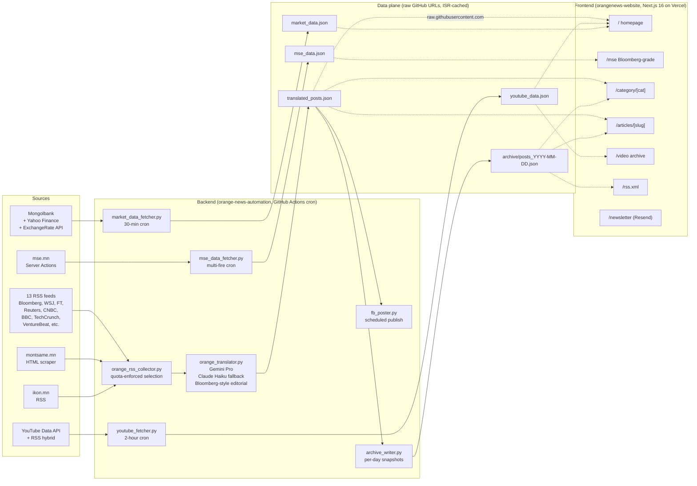

# Azurise Solution — Sales Deck (Draft)

> **Phase 9.1 deliverable.** Markdown-format draft for fast iteration; convert to Google Slides / Keynote / PowerPoint after founder review. 15 slides separated by `---`. Sections marked **[FOUNDER ADJUST]** need founder voice / commercial decisions before sharing externally.
>
> **Source of truth:** Production state of `mctunghai-pixel/orange-news-automation` + `mctunghai-pixel/orangenews-website` as of **2026-05-06**.

---

## Slide 1 — Title

# **Azurise Solution**
### Bloomberg-grade Mongolian financial portal infrastructure

**Munkhsaikhan Mongolbayar** [FOUNDER ADJUST: full title / role line]
2026-05-06 · Live demo: [www.orangenews.mn](https://www.orangenews.mn)

---

## Slide 2 — The problem

### Mongolian financial professionals need Bloomberg-grade content. Today they have to choose:

- **Bloomberg / Reuters Eikon / FT terminal** — international quality, international cost (USD 2,000+ per seat per month), English-only.
- **Domestic Mongolian outlets** (ikon.mn, news.mn, gogo.mn, etc.) — accessible, but consumer-grade editorial, no MSE-quality market data, no curated international synthesis.
- **Manual workflow** — analysts re-translate Bloomberg / WSJ articles by hand. Slow, inconsistent, doesn't scale.

There is **no Mongolian-language equivalent to a Bloomberg-style daily briefing**, end-to-end automated, with both global-source and domestic content.

> [FOUNDER ADJUST] Replace this with the specific customer-pain narrative — what TDB / Khan / BoMongolia analysts have actually told you about this gap. The framing above is engineering's best inference; founder's lived knowledge is sharper.

---

## Slide 3 — Solution overview

### Orange News.mn — production-grade Mongolian financial portal, fully automated

**Live demo:** **[www.orangenews.mn](https://www.orangenews.mn)**

What it is:
- **Daily Bloomberg-style briefing in Mongolian Cyrillic** — 10 curated articles, auto-translated and edited from 14 international + native sources.
- **Live MSE data page** — Bloomberg-grade market-data layout with marquee tickers, top movers, mining trades, listed-company directory.
- **7-day rolling article archive** — yesterday's articles still resolve and are searchable.
- **Curated international video feed** — 33 most recent videos from Bloomberg Television, WSJ, Reuters, Financial Times, CNBC, World Bank, refreshed every 2 hours.
- **Auto-Facebook publishing** — same content lands on a public FB page on the same daily cadence.

What "Azurise Solution" sells: the same stack as a **white-label deployment** for a bank, securities firm, government regulator, or media partner.

---

## Slide 4 — Production architecture

Every dotted edge crosses GitHub raw + Vercel ISR — no bespoke server, no database. **Operational footprint is 4 GitHub Actions workflows + 1 Vercel project.**

---

## Slide 5 — Key features (live)

| Feature | Where | What it shows |
|---|---|---|
| **Live MarketSnapshot** | homepage | S&P, Nasdaq, Bitcoin, MSE TOP-20, FX, gold, oil — refreshed every 30 min |
| **Bloomberg-grade /mse page** | `/mse` | marquee tickers, top movers, mining trades, A/B-board directory — 8 datasets from mse.mn server actions |
| **Daily article archive** | `/category/[cat]`, `/articles/[slug]` | 7-day rolling window; yesterday's articles still resolvable |
| **Live video aggregation** | `/video` + homepage right-rail | 33 curated videos from 6 international financial channels, refreshed every 2 hours |
| **RSS feed** | `/rss.xml` | 7-day window, top-20-by-score |
| **Newsletter signup** | homepage + `/newsletter` | Resend double-opt-in, GDPR-friendly |
| **Auto-Facebook publishing** | facebook.com/orangenews.mn | 10 daily posts published with editorial polish |

> **Screenshots to embed before sharing:**
> 1. Homepage hero + MarketSnapshot — viewport 1440×900
> 2. `/mse` Bloomberg-grade page — viewport 1440×900
> 3. `/video` 3-column grid — viewport 1440×900
> 4. Mobile homepage (with right-rail video stack) — viewport 375×812

---

## Slide 6 — Editorial discipline

Every article passes the same Bloomberg-style polish pass — the same rules a desk editor would apply. Side-by-side example from today's pipeline:

**Source (Montsame, original Mongolian):**
> "Эрчим хүч үйлдвэрлэх, дамжуулах, түгээх, хангах өртөг зардлыг багасгахыг зорьж байна"
> *(84 characters, soft verb, no concrete number — translates as "We are aiming to reduce energy production / transmission / distribution / supply costs.")*

**Polished (Orange News output):**
> **"Засгийн газар эрчим хүчний өртөг 3%-иар багасгахаар шийдвэрлэв"**
> *(62 characters, declarative past tense, concrete "3%" lede — "Government decided to reduce energy cost by 3%.")*

The same editorial pass enforces:
- **Headline length 60-80 characters** (matches Bloomberg / Reuters terminal conventions)
- **Past-tense declarative verbs** (the "шийдвэрлэв" suffix)
- **Concrete numbers in the lede** when the source has them
- **Source attribution footer** ("Эх сурвалж: Montsame", "Эх сурвалж: Bloomberg")
- **No literal calque translations** (Rule 0 — flagged as Day 5 production lesson)
- **OrangeNews social footer** with Facebook + Instagram + Threads links

This editorial layer is what separates Azurise Solution from a generic translation service.

---

## Slide 7 — Tech stack

**Frontend (`orangenews-website`):**
- **Next.js 16.2.4** + **React 19.2.4** (App Router, Turbopack)
- **Tailwind CSS v4**, custom Mongolian-Cyrillic typography
- **Vercel** hosting + ISR caching
- **Resend** for newsletter (double opt-in, GDPR-friendly)
- **6 npm dependencies total** — minimal, audited

**Backend (`orange-news-automation`):**
- **Python 3.11** — feedparser, BeautifulSoup, requests, anthropic, google-genai
- **GitHub Actions** scheduled cron (4 production workflows)
- **Gemini Pro** primary translator, **Claude Haiku** fallback
- **Multi-source fetch:** 13 RSS feeds + Montsame HTML scraper + ikon.mn + mse.mn server actions + YouTube Data API + Mongolbank/Yahoo/ExchangeRate APIs

**Operational cost:**
- Vercel free tier sufficient for current traffic
- GitHub Actions free tier sufficient (~12 min/month total CI)
- Gemini API: paid usage ~USD 30-50/month at current 10-post/day cadence
- Claude API fallback: paid usage ~USD 10-20/month
- Resend free tier: 3K emails/month, 100 contacts (sufficient through pilot)
- **Total run-rate: ~USD 40-70/month for the entire platform**

---

## Slide 8 — Production metrics (live, snapshot 2026-05-06)

| Dimension | Number |
|---|---|
| **Daily article output** | 10 posts/day, auto-published |
| **Mongolian-language source mix** | 2 of 10 daily posts (20% — ikon.mn + Montsame) |
| **Curated video feed** | 33 videos, 6 channels, refreshed every 2 hours |
| **Article archive** | 7-day rolling, all dates indexed (`archive/index.json`) |
| **Production routes** | 7 public (`/`, `/mse`, `/video`, `/category/[cat]`, `/articles/[slug]`, `/rss.xml`, `/newsletter`) — all HTTP 200 |
| **Production workflows (cron)** | 4 (orange_news, mse_update, market_watch_live, youtube_update) |
| **Last 24h uptime** | 100% — zero failed scheduled runs |
| **Pipeline runtime** | full daily pipeline ~5-9 min · video refresh ~30 sec |
| **GitHub Actions secrets configured** | 5 (Gemini, Anthropic, FB Page+Token, YouTube) |
| **Codebase size** | backend ~14 Python files · frontend ~30 routes/components · combined ~5K LOC |

---

## Slide 9 — Use cases (white-label customers)

> [FOUNDER ADJUST] Refine this list based on actual conversations / target customer pipeline.

| Customer type | What they get | Why it matters to them |
|---|---|---|
| **Commercial banks** (TDB, Khan, Golomt, State Bank, Capital Bank) | Branded daily financial briefing on their own subdomain (e.g., `markets.tdb.mn`); pushes via their existing app/email | Differentiation vs other banks' research; client retention tool |
| **Securities firms** (TDB Securities, BDSec, Golomt Securities) | Same daily briefing + curated MSE data; positioned as research distribution | Brokerage research is expensive to produce; this is a 10× cost-down |
| **Government / regulators** (Bank of Mongolia, FRC, Ministry of Finance) | Investor-education portal with editorial-controlled financial-literacy content | Mandate: improve retail-investor financial literacy; deliverable they can show stakeholders |
| **Mongolian media outlets** (Eagle, NTV, etc.) | Content licensing — daily briefing as syndicated section | Saves them an editorial seat for the international-finance beat |
| **Multinational corporates** with Mongolia exposure (Rio Tinto, Oyu Tolgoi LLC) | Localized internal brief for Mongolian-Cyrillic-reading staff | Internal communication compliance + market awareness |

---

## Slide 10 — Pricing model (placeholder — founder adjusts)

> **[FOUNDER ADJUST]** All numbers below are placeholders. Founder sets actual pricing based on customer-discovery conversations.

| Tier | What they get | Setup | Monthly |
|---|---|---|---|
| **Tier 1 — Branded subdomain (shared backend)** | their logo + colors on `<customer>.azurise.mn`, same content as Orange News | $X one-time | $Y/month |
| **Tier 2 — White-label deployment** | their own domain, separate Vercel project, optionally customized topic mix / sources | $X one-time | $Y/month |
| **Tier 3 — Full custom build (partnership)** | domain + custom topic curation + custom editorial rules + API access for their own product | $X one-time + revenue share | $Y/month + % |
| **Add-on: Custom Mongolian editorial workflow** | their staff edits via a CMS layer (Phase 7.2.2 deferred) | $X one-time | $Y/month |
| **Add-on: API access** | programmatic JSON feed for their own systems | — | $Y/month |

Anchor reference: a Bloomberg Terminal seat is **~USD 2,000/month**. Tier 1 should price at a small fraction of that to be obvious value for an analyst-team sized customer.

---

## Slide 11 — Competitive moat

**What's hard to replicate:**

1. **Bloomberg-grade Mongolian editorial pipeline.** This took 7 days of focused work + ~50 production commits to land. A competitor starting from scratch faces the same multi-week investment, plus the institutional knowledge of WHICH editorial rules matter (Rule 0 calque-avoidance, headline 60-80 chars, past-tense declarative verbs, source-footer convention) — knowledge that lives in the codebase + CLAUDE.md docs.
2. **Production-grade infrastructure with near-zero ops.** Stateless data plane via raw GitHub URLs + ISR; no database to administer, no servers to patch. A competitor would either copy this pattern (we already shipped it) or take on operational debt that grows with scale.
3. **Multi-source ingest already mature.** 13 RSS feeds + 1 HTML scraper + 1 server-actions endpoint + 1 YouTube hybrid = significant integration breadth. Each adapter took its own recon (Montsame: confirmed Mongolian web doesn't expose RSS; MSE: discovered Next.js Server Actions endpoint over 2 days). A new entrant pays this discovery cost again.
4. **Mongolian Cyrillic + bilingual editorial knowledge.** Founder's domain expertise + the prompt-engineering lessons baked into `orange_translator.py` (~1700 LOC, including dedicated `process_mongolian_article` passthrough for native-language sources) are a moat that a generic LLM-translation startup doesn't have.

**What's easy to replicate (don't bet the moat on these):**
- Writing a Next.js frontend
- Setting up Vercel
- Calling Gemini / Claude APIs

The moat is the **editorial layer + the multi-source institutional knowledge + the operational discipline**, not the framework.

---

## Slide 12 — Roadmap

**Shipped (Day 1-9):** Phase 4 (Bloomberg portal foundation) → Phase 5 (real-time market data) → Phase 6.1.7 (translation quality + editorial polish) → Phase 6.2 (MSE Bloomberg-grade page) → Phase 7.1 (article archive) → Phase 7.2.1 (Resend subscribe) → Phase 7.3 (live video aggregation) → Phase 8.1 (Slack failure notifications) → Phase 6.1.5 (Montsame Mongolian scraper).

**Reserved (next 6-12 weeks):**

| Phase | Description | Effort |
|---|---|---|
| **7.2.2** | Customer self-service editorial layer (CMS for Tier-1 customers) | 1-2 weeks |
| **7.1.x** | Date-filter UI on `/category/[cat]`, /category page widening to 7-day archive | ~3 days |
| **8.1.x** | Email-fallback alerting via Resend (Slack outage redundancy) + paging escalation for repeat failures | ~2 days |
| **9.2** | Multi-tenant architecture — same backend, multiple branded frontends | 2-3 weeks |
| **9.3** | Customer onboarding API + admin dashboard | 2-3 weeks |
| **10.1** | Mongolian-language LLM API for partners (programmatic translation-as-a-service) | TBD |

**Q3 2026 target:** first commercial customer onboarded.
**Q4 2026 target:** multi-tenant architecture live.
**Q1 2027 target:** 3-5 paying customers, customer self-service editorial.
**Q2 2027 target:** API revenue stream.

---

## Slide 13 — Founder

**Munkhsaikhan Mongolbayar** [FOUNDER ADJUST: full title]

> [FOUNDER ADJUST] Bio paragraph — founder fills in:
> - Background (education, prior roles)
> - Why Orange News exists (the personal motivation)
> - Why founder is the right person to build this (relevant network, domain knowledge, prior execution)

**Contact:** mc.tunghai@gmail.com

---

## Slide 14 — Demo + next steps

### See it live
**[www.orangenews.mn](https://www.orangenews.mn)** — homepage, `/mse`, `/video`, RSS feed, daily Facebook page

### What to do next
1. **15-min discovery call** — what does your target customer audience need from a Mongolian financial portal? What does Bloomberg cost them today, and what would they pay for an alternative?
2. **30-min product demo** — live walkthrough of the production stack, including admin / publishing flow.
3. **Pilot proposal** — branded subdomain + 30-day evaluation period, founder-led customization.

### Contact
**Munkhsaikhan Mongolbayar** [FOUNDER ADJUST]
mc.tunghai@gmail.com

---

## Slide 15 — Appendix · Technical FAQ

**Q: What's the editorial QA process?**
> Every article passes through the `orange_translator.py` pipeline: source-text fetch → Gemini-Pro polish (with Claude-Haiku fallback) → Rule-0/Rule-7 enforcement → headline-length validation → footer/hashtag append. Production failures trigger Slack notifications (Phase 8.1 Track A). Human spot-checks happen at the founder level on a daily basis during the pilot.

**Q: What's the SLA?**
> [FOUNDER ADJUST] Internal observed: 100% scheduled-run success over the past 24h; the past 9 days have had 1 silent failure (Day 5 readability dependency, fixed within 4 hours of detection). For a paid customer, target ≥99% uptime per month with ≤2-hour MTTR on failures.

**Q: How is content licensed?**
> [FOUNDER ADJUST] Each source has its own RSS / scraping ToS. The current Mongolian-language polish + editorial rendering is original work (translation + editorial transformation, not verbatim republication). Founder + legal counsel should review before commercial deployment to ensure attribution practices match each source's licensing position.

**Q: Can a customer customize the topic mix?**
> Yes — `RSS_FEEDS` is a single dict in `orange_rss_collector.py`; per-customer feed lists + per-customer topic quotas are straightforward. Customer-specific overrides are part of Phase 9.2 (multi-tenant architecture).

**Q: Does it work offline / on-premise?**
> The fetch + translation pipeline requires internet (RSS, scraper, LLM APIs). The frontend is statically rendered (Next.js ISR) so it serves last-known-good content even if the backend goes down. The data plane uses GitHub raw URLs as the canonical store — operationally distributed, no single point of failure for reads.

**Q: How long would a Tier-1 deployment take?**
> Branded subdomain + customer-color application + customer-logo replacement: ≤1 week from contract signature.

**Q: What about Mongolian-language LLM quality?**
> Gemini Pro produces Bloomberg-grade Mongolian Cyrillic for current source-pool. Claude Haiku is the fallback. The translator carries 1700+ lines of prompt-engineering + Rule-0 calque-avoidance + Rule-7 footer enforcement that took multi-day iteration to land. Quality is meaningfully ahead of generic GPT-4 translation for Mongolian financial content.

**Q: What if Montsame / mse.mn / Bloomberg RSS changes their HTML?**
> Maintenance docs in the backend repo (`docs/montsame_phase6.1.5.md`, `docs/mse_phase6.2_endpoint.md`) include selector-update playbooks. Slack failure notification (when wired) gives sub-minute awareness of any breakage.

---

## Founder review checklist

After founder review, the following sections need editing before the deck is shareable externally:

- [ ] Slide 1 — confirm role title in subtitle
- [ ] Slide 2 — replace "engineering's best inference" pain narrative with founder's lived account
- [ ] Slide 9 — refine target-customer list (add specific named contacts where relevant)
- [ ] Slide 10 — fill in actual pricing values for Tiers 1-3
- [ ] Slide 13 — write founder bio paragraph
- [ ] Slide 14 — confirm contact info + add LinkedIn / phone if relevant
- [ ] Slide 15 — review FAQ content licensing answer with legal counsel
- [ ] All slides — capture screenshots at the recommended viewports (or schedule with a designer)
- [ ] Convert to Google Slides / Keynote / PowerPoint format for actual sharing

Estimated founder review time: **~30 minutes**.
